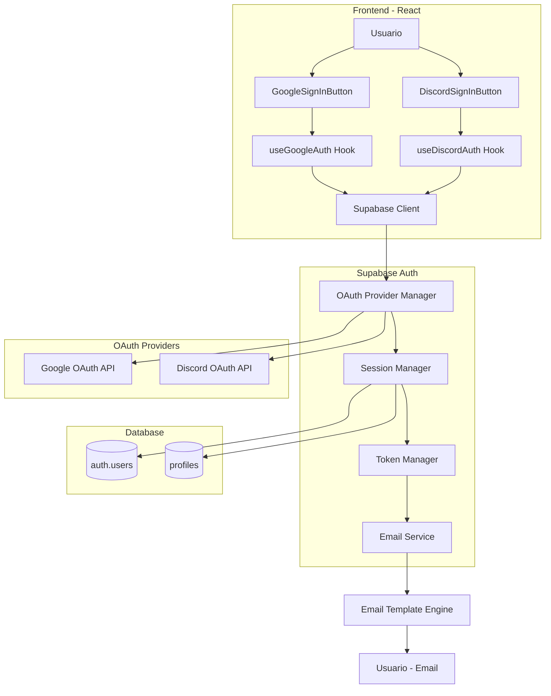
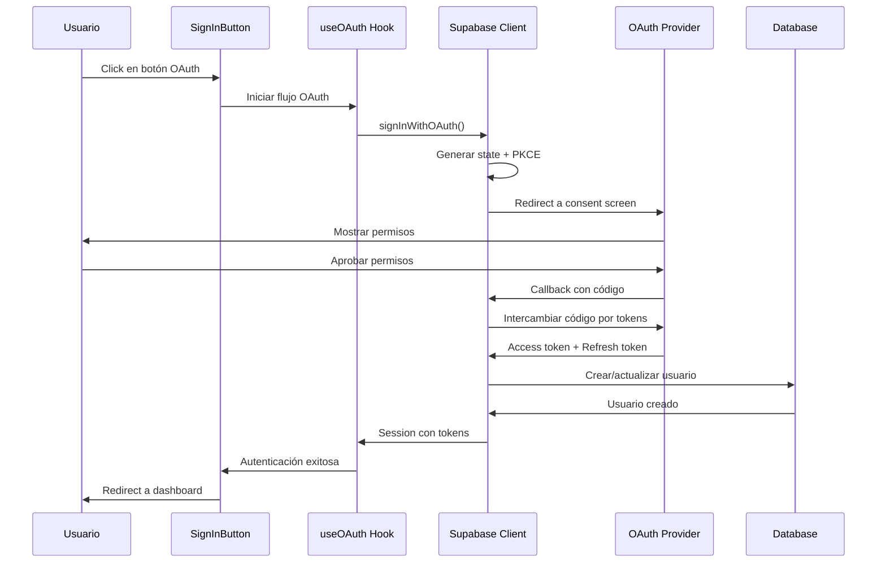

# Design Document: OAuth Authentication Guide

## Overview

Este documento describe el diseño técnico para implementar una guía completa de autenticación OAuth con Google y Discord en Kasino21. La solución se integra con Supabase Auth como proveedor centralizado de autenticación, proporcionando una experiencia de usuario fluida y segura.

### Objetivos del Diseño

1. **Integración OAuth Completa**: Implementar flujos de autenticación con Google y Discord usando Supabase Auth como intermediario
2. **Experiencia de Usuario Consistente**: Proporcionar componentes React reutilizables con el estilo visual de Kasino21
3. **Seguridad Robusta**: Implementar mejores prácticas de seguridad OAuth incluyendo PKCE, validación de estado y manejo seguro de tokens
4. **Branding Personalizado**: Crear plantillas de correo HTML personalizadas con el tema visual de Kasino21
5. **Documentación Completa**: Proporcionar guías paso a paso para configuración en desarrollo y producción

### Alcance

**Incluido en este diseño:**
- Configuración de proveedores OAuth (Google y Discord)
- Integración con Supabase Auth
- Componentes React para botones de OAuth
- Custom hooks para lógica de autenticación
- Plantillas de correo HTML personalizadas
- Manejo de errores y estados de carga
- Configuración de entornos (desarrollo y producción)
- Documentación técnica completa

**Excluido de este diseño:**
- Autenticación con otros proveedores OAuth (Facebook, Twitter, etc.)
- Implementación de autenticación de dos factores (2FA)
- Migración de usuarios existentes desde otros sistemas
- Implementación de roles y permisos avanzados

## Architecture

### Arquitectura de Alto Nivel



### Flujo de Autenticación OAuth



### Arquitectura de Componentes

La arquitectura sigue el patrón de separación de responsabilidades existente en Kasino21:

1. **Capa de Presentación** (`src/web/components/auth/`): Componentes visuales de botones OAuth
2. **Capa de Aplicación** (`src/web/hooks/`): Lógica de negocio en custom hooks
3. **Capa de Servicios** (`src/web/services/`): Cliente de Supabase y configuración
4. **Capa de Dominio** (implícita): Tipos TypeScript para User, Session, AuthError

## Components and Interfaces

### 1. Componentes React

#### GoogleSignInButton

Componente visual para el botón de inicio de sesión con Google.

```typescript
interface GoogleSignInButtonProps {
  /** Texto del botón (default: "Continuar con Google") */
  label?: string;
  /** Clase CSS adicional para personalización */
  className?: string;
  /** Callback ejecutado después de autenticación exitosa */
  onSuccess?: (session: Session) => void;
  /** Callback ejecutado en caso de error */
  onError?: (error: AuthError) => void;
  /** Deshabilitar el botón */
  disabled?: boolean;
}

export function GoogleSignInButton(props: GoogleSignInButtonProps): JSX.Element;
```

**Responsabilidades:**
- Renderizar botón con estilo de Kasino21
- Mostrar estados de carga y deshabilitado
- Invocar hook `useGoogleAuth` para lógica de autenticación
- Manejar callbacks de éxito y error

#### DiscordSignInButton

Componente visual para el botón de inicio de sesión con Discord.

```typescript
interface DiscordSignInButtonProps {
  /** Texto del botón (default: "Continuar con Discord") */
  label?: string;
  /** Clase CSS adicional para personalización */
  className?: string;
  /** Callback ejecutado después de autenticación exitosa */
  onSuccess?: (session: Session) => void;
  /** Callback ejecutado en caso de error */
  onError?: (error: AuthError) => void;
  /** Deshabilitar el botón */
  disabled?: boolean;
}

export function DiscordSignInButton(props: DiscordSignInButtonProps): JSX.Element;
```

**Responsabilidades:**
- Renderizar botón con estilo de Kasino21
- Mostrar estados de carga y deshabilitado
- Invocar hook `useDiscordAuth` para lógica de autenticación
- Manejar callbacks de éxito y error

### 2. Custom Hooks

#### useGoogleAuth

Hook personalizado para manejar la lógica de autenticación con Google.

```typescript
interface UseGoogleAuthReturn {
  /** Iniciar flujo de autenticación con Google */
  signInWithGoogle: () => Promise<void>;
  /** Estado de carga durante autenticación */
  loading: boolean;
  /** Error si ocurre durante autenticación */
  error: AuthError | null;
  /** Sesión actual del usuario */
  session: Session | null;
}

export function useGoogleAuth(): UseGoogleAuthReturn;
```

**Responsabilidades:**
- Invocar `supabase.auth.signInWithOAuth()` con proveedor Google
- Configurar redirect URLs apropiadas
- Manejar estados de carga y error
- Retornar sesión después de autenticación exitosa

#### useDiscordAuth

Hook personalizado para manejar la lógica de autenticación con Discord.

```typescript
interface UseDiscordAuthReturn {
  /** Iniciar flujo de autenticación con Discord */
  signInWithDiscord: () => Promise<void>;
  /** Estado de carga durante autenticación */
  loading: boolean;
  /** Error si ocurre durante autenticación */
  error: AuthError | null;
  /** Sesión actual del usuario */
  session: Session | null;
}

export function useDiscordAuth(): UseDiscordAuthReturn;
```

**Responsabilidades:**
- Invocar `supabase.auth.signInWithOAuth()` con proveedor Discord
- Configurar redirect URLs apropiadas
- Manejar estados de carga y error
- Retornar sesión después de autenticación exitosa

### 3. Servicios

#### OAuth Configuration Service

Servicio para gestionar configuración de OAuth según el entorno.

```typescript
interface OAuthConfig {
  /** URL de redirect para desarrollo */
  redirectUrlDev: string;
  /** URL de redirect para producción */
  redirectUrlProd: string;
  /** Scopes requeridos para Google */
  googleScopes: string[];
  /** Scopes requeridos para Discord */
  discordScopes: string[];
}

export const oauthConfig: OAuthConfig;

/** Obtener redirect URL según entorno actual */
export function getRedirectUrl(): string;

/** Validar configuración de OAuth */
export function validateOAuthConfig(): boolean;
```

### 4. Tipos TypeScript

```typescript
/** Error de autenticación OAuth */
export interface AuthError {
  message: string;
  code: string;
  status?: number;
}

/** Opciones para signInWithOAuth */
export interface OAuthSignInOptions {
  provider: 'google' | 'discord';
  options?: {
    redirectTo?: string;
    scopes?: string;
    queryParams?: Record<string, string>;
  };
}

/** Resultado de autenticación OAuth */
export interface OAuthResponse {
  session: Session | null;
  user: User | null;
  error: AuthError | null;
}
```

## Data Models

### Modelo de Usuario (auth.users)

Tabla gestionada por Supabase Auth. No requiere modificaciones.

```sql
-- Tabla auth.users (gestionada por Supabase)
-- Campos relevantes:
-- id: uuid (PK)
-- email: text
-- email_confirmed_at: timestamp
-- created_at: timestamp
-- updated_at: timestamp
-- raw_user_meta_data: jsonb (contiene datos del proveedor OAuth)
```

### Modelo de Perfil (profiles)

Tabla existente en Kasino21 que se extiende con información de OAuth.

```sql
-- Tabla profiles (existente, sin modificaciones necesarias)
-- La información del proveedor OAuth se almacena en auth.users.raw_user_meta_data
-- Campos relevantes:
-- id: uuid (PK, FK a auth.users.id)
-- username: text
-- avatar_url: text (puede poblarse desde OAuth provider)
-- elo: integer
-- coins: integer
-- created_at: timestamp
-- last_seen_at: timestamp
```

### Metadata de OAuth

Los proveedores OAuth retornan metadata que Supabase almacena en `raw_user_meta_data`:

**Google OAuth Metadata:**
```json
{
  "provider": "google",
  "email": "user@gmail.com",
  "email_verified": true,
  "name": "John Doe",
  "picture": "https://lh3.googleusercontent.com/...",
  "sub": "1234567890"
}
```

**Discord OAuth Metadata:**
```json
{
  "provider": "discord",
  "email": "user@example.com",
  "email_verified": true,
  "name": "DiscordUser#1234",
  "avatar": "https://cdn.discordapp.com/avatars/...",
  "sub": "9876543210"
}
```

## Error Handling

### Estrategia de Manejo de Errores

1. **Errores de Red**: Reintentar automáticamente con backoff exponencial
2. **Errores de Autorización**: Mostrar mensaje claro al usuario
3. **Errores de Configuración**: Loggear en consola para debugging
4. **Errores de Validación**: Mostrar feedback específico

### Tipos de Errores OAuth

```typescript
enum OAuthErrorCode {
  // Errores de configuración
  MISSING_CREDENTIALS = 'oauth_missing_credentials',
  INVALID_REDIRECT_URL = 'oauth_invalid_redirect_url',
  
  // Errores de flujo OAuth
  USER_DENIED = 'oauth_user_denied',
  INVALID_STATE = 'oauth_invalid_state',
  EXPIRED_CODE = 'oauth_expired_code',
  
  // Errores de red
  NETWORK_ERROR = 'oauth_network_error',
  TIMEOUT = 'oauth_timeout',
  
  // Errores de Supabase
  SUPABASE_ERROR = 'oauth_supabase_error',
  SESSION_ERROR = 'oauth_session_error',
}
```

### Manejo de Errores en Componentes

```typescript
// Ejemplo de manejo de errores en GoogleSignInButton
try {
  await signInWithGoogle();
  onSuccess?.(session);
} catch (error) {
  const authError = normalizeError(error);
  
  switch (authError.code) {
    case OAuthErrorCode.USER_DENIED:
      showToast('Necesitamos tu permiso para continuar', 'warning');
      break;
    case OAuthErrorCode.NETWORK_ERROR:
      showToast('Error de conexión. Por favor intenta de nuevo', 'error');
      break;
    default:
      showToast('Error al iniciar sesión. Intenta de nuevo', 'error');
      logger.error('OAuth error:', authError);
  }
  
  onError?.(authError);
}
```

### Logging de Errores

```typescript
// Estructura de log para errores OAuth
interface OAuthErrorLog {
  timestamp: string;
  provider: 'google' | 'discord';
  errorCode: OAuthErrorCode;
  errorMessage: string;
  userId?: string;
  metadata?: Record<string, any>;
}

// Función de logging
function logOAuthError(log: OAuthErrorLog): void {
  logger.error('[OAuth Error]', {
    ...log,
    environment: import.meta.env.MODE,
  });
}
```

## Testing Strategy

### Enfoque de Testing

Esta feature de OAuth Authentication Guide es principalmente **documentación y configuración**, no código de lógica de negocio compleja. Por lo tanto, **Property-Based Testing NO es aplicable** aquí.

La estrategia de testing se enfocará en:

1. **Unit Tests**: Para componentes React y hooks personalizados
2. **Integration Tests**: Para flujos completos de OAuth con Supabase
3. **Manual Testing**: Para validar configuración de proveedores OAuth
4. **Email Template Testing**: Para validar renderizado en diferentes clientes de correo

### Unit Tests

**Componentes a testear:**

1. **GoogleSignInButton**
   - Renderiza correctamente con props por defecto
   - Muestra estado de carga cuando `loading=true`
   - Está deshabilitado cuando `disabled=true`
   - Invoca `onSuccess` callback después de autenticación exitosa
   - Invoca `onError` callback cuando falla autenticación
   - Aplica clases CSS personalizadas correctamente

2. **DiscordSignInButton**
   - Renderiza correctamente con props por defecto
   - Muestra estado de carga cuando `loading=true`
   - Está deshabilitado cuando `disabled=true`
   - Invoca `onSuccess` callback después de autenticación exitosa
   - Invoca `onError` callback cuando falla autenticación
   - Aplica clases CSS personalizadas correctamente

3. **useGoogleAuth Hook**
   - Retorna estado inicial correcto (`loading: false, error: null, session: null`)
   - Cambia `loading` a `true` durante autenticación
   - Retorna `session` después de autenticación exitosa
   - Retorna `error` cuando falla autenticación
   - Invoca `supabase.auth.signInWithOAuth` con parámetros correctos

4. **useDiscordAuth Hook**
   - Retorna estado inicial correcto (`loading: false, error: null, session: null`)
   - Cambia `loading` a `true` durante autenticación
   - Retorna `session` después de autenticación exitosa
   - Retorna `error` cuando falla autenticación
   - Invoca `supabase.auth.signInWithOAuth` con parámetros correctos

**Herramientas:**
- **Vitest**: Framework de testing (ya usado en Kasino21)
- **React Testing Library**: Para testing de componentes React
- **MSW (Mock Service Worker)**: Para mockear llamadas a Supabase

### Integration Tests

**Flujos a testear:**

1. **Flujo completo de Google OAuth**
   - Usuario hace click en GoogleSignInButton
   - Se abre ventana de consent de Google (mockeada)
   - Usuario aprueba permisos
   - Callback retorna código de autorización
   - Supabase intercambia código por tokens
   - Usuario es redirigido a dashboard con sesión activa

2. **Flujo completo de Discord OAuth**
   - Usuario hace click en DiscordSignInButton
   - Se abre ventana de consent de Discord (mockeada)
   - Usuario aprueba permisos
   - Callback retorna código de autorización
   - Supabase intercambia código por tokens
   - Usuario es redirigido a dashboard con sesión activa

3. **Manejo de errores**
   - Usuario deniega permisos en consent screen
   - Error de red durante intercambio de tokens
   - Código de autorización expirado
   - Estado inválido (posible ataque CSRF)

**Herramientas:**
- **Playwright**: Para testing end-to-end con navegador real
- **Supabase Local Dev**: Para testing contra instancia local de Supabase

### Manual Testing Checklist

**Configuración de Proveedores:**
- [ ] Google Cloud Console: Proyecto creado y OAuth API habilitada
- [ ] Google Cloud Console: Client ID y Client Secret generados
- [ ] Google Cloud Console: Redirect URIs configuradas (dev y prod)
- [ ] Discord Developer Portal: Aplicación creada
- [ ] Discord Developer Portal: Client ID y Client Secret generados
- [ ] Discord Developer Portal: Redirect URIs configuradas (dev y prod)
- [ ] Supabase Dashboard: Google provider configurado
- [ ] Supabase Dashboard: Discord provider configurado
- [ ] Variables de entorno configuradas en `.env`

**Testing de Flujos:**
- [ ] Login con Google en desarrollo funciona
- [ ] Login con Discord en desarrollo funciona
- [ ] Login con Google en producción funciona
- [ ] Login con Discord en producción funciona
- [ ] Redirect después de login funciona correctamente
- [ ] Sesión persiste después de reload de página
- [ ] Logout funciona correctamente
- [ ] Email de confirmación se envía (si está habilitado)

**Testing de Email Templates:**
- [ ] Email se renderiza correctamente en Gmail (desktop)
- [ ] Email se renderiza correctamente en Gmail (mobile)
- [ ] Email se renderiza correctamente en Outlook (desktop)
- [ ] Email se renderiza correctamente en Apple Mail (iOS)
- [ ] Logo de Kasino21 se muestra correctamente
- [ ] Colores del tema (#D4AF37 gold) se aplican correctamente
- [ ] Botón de confirmación es clickeable
- [ ] Texto fallback se muestra en clientes sin HTML

### Test Coverage Goals

- **Unit Tests**: 80% de cobertura en componentes y hooks
- **Integration Tests**: 100% de cobertura en flujos críticos (login exitoso, errores comunes)
- **Manual Tests**: 100% de checklist completado antes de deployment a producción

### Continuous Integration

```yaml
# Ejemplo de workflow de CI para testing OAuth
name: OAuth Tests

on: [push, pull_request]

jobs:
  test:
    runs-on: ubuntu-latest
    steps:
      - uses: actions/checkout@v3
      - uses: actions/setup-node@v3
      - run: npm install
      - run: npm run test:unit
      - run: npm run test:integration
      - run: npm run test:e2e
```

## Implementation Notes

### Configuración de Variables de Entorno

**Desarrollo (.env.local):**
```bash
# Supabase
VITE_SUPABASE_URL=https://your-project.supabase.co
VITE_SUPABASE_ANON_KEY=your-anon-key

# Google OAuth
VITE_GOOGLE_CLIENT_ID=your-google-client-id.apps.googleusercontent.com

# Discord OAuth
VITE_DISCORD_CLIENT_ID=your-discord-client-id

# Redirect URLs
VITE_OAUTH_REDIRECT_URL=http://localhost:5173/auth/callback
```

**Producción (.env.production):**
```bash
# Supabase
VITE_SUPABASE_URL=https://your-project.supabase.co
VITE_SUPABASE_ANON_KEY=your-anon-key

# Google OAuth
VITE_GOOGLE_CLIENT_ID=your-google-client-id.apps.googleusercontent.com

# Discord OAuth
VITE_DISCORD_CLIENT_ID=your-discord-client-id

# Redirect URLs
VITE_OAUTH_REDIRECT_URL=https://kasino21.com/auth/callback
```

### Estructura de Archivos

```
src/web/
├── components/
│   └── auth/
│       ├── GoogleSignInButton.tsx
│       ├── DiscordSignInButton.tsx
│       └── OAuthCallback.tsx
├── hooks/
│   ├── useAuth.tsx (existente, sin modificaciones)
│   ├── useGoogleAuth.tsx
│   └── useDiscordAuth.tsx
├── services/
│   ├── supabase.ts (existente, sin modificaciones)
│   └── oauth-config.ts
├── utils/
│   └── oauth-errors.ts
└── types/
    └── oauth.ts

.kiro/specs/oauth-authentication-guide/
├── requirements.md (existente)
├── design.md (este documento)
├── tasks.md (a crear)
└── docs/
    ├── google-oauth-setup.md
    ├── discord-oauth-setup.md
    ├── supabase-configuration.md
    ├── email-templates.md
    └── troubleshooting.md
```

### Integración con useAuth Existente

El hook `useAuth` existente ya maneja la sesión de Supabase. Los nuevos hooks de OAuth (`useGoogleAuth`, `useDiscordAuth`) **NO reemplazan** a `useAuth`, sino que lo complementan:

```typescript
// useAuth (existente) - Maneja sesión global
const { session, user, profile, loading, signOut } = useAuth();

// useGoogleAuth (nuevo) - Solo para iniciar login con Google
const { signInWithGoogle, loading: googleLoading } = useGoogleAuth();

// useDiscordAuth (nuevo) - Solo para iniciar login con Discord
const { signInWithDiscord, loading: discordLoading } = useDiscordAuth();
```

**Flujo de integración:**
1. Usuario hace click en `GoogleSignInButton`
2. `useGoogleAuth` inicia flujo OAuth con Supabase
3. Después de autenticación exitosa, Supabase actualiza la sesión
4. `useAuth` detecta cambio de sesión vía `onAuthStateChange`
5. `useAuth` actualiza estado global y fetch profile
6. Aplicación redirige a dashboard

### Plantilla de Email HTML

La plantilla de email debe seguir el estilo visual de Kasino21:

**Características:**
- Color primario: Gold (#D4AF37)
- Fondo oscuro: #1a1a1a
- Logo: brand21Icon.png
- Tipografía: Sans-serif moderna
- Layout responsive con tablas HTML
- Inline CSS para compatibilidad

**Estructura básica:**
```html
<!DOCTYPE html>
<html>
<head>
  <meta charset="utf-8">
  <meta name="viewport" content="width=device-width, initial-scale=1.0">
  <title>Confirma tu cuenta - Kasino21</title>
</head>
<body style="margin: 0; padding: 0; background-color: #1a1a1a; font-family: Arial, sans-serif;">
  <table role="presentation" style="width: 100%; border-collapse: collapse;">
    <tr>
      <td align="center" style="padding: 40px 0;">
        <!-- Logo -->
        
        
        <!-- Contenido principal -->
        <table role="presentation" style="width: 600px; max-width: 100%; background-color: #2a2a2a; border-radius: 8px; margin-top: 20px;">
          <tr>
            <td style="padding: 40px;">
              <h1 style="color: #D4AF37; margin: 0 0 20px 0;">¡Bienvenido a Kasino21!</h1>
              <p style="color: #ffffff; line-height: 1.6;">Confirma tu dirección de correo para comenzar a jugar.</p>
              
              <!-- Botón CTA -->
              <table role="presentation" style="margin: 30px 0;">
                <tr>
                  <td style="background-color: #D4AF37; border-radius: 4px;">
                    <a href="{{ .ConfirmationURL }}" style="display: inline-block; padding: 12px 30px; color: #1a1a1a; text-decoration: none; font-weight: bold;">
                      Confirmar Email
                    </a>
                  </td>
                </tr>
              </table>
              
              <p style="color: #888888; font-size: 14px;">Si no creaste esta cuenta, puedes ignorar este correo.</p>
            </td>
          </tr>
        </table>
        
        <!-- Footer -->
        <p style="color: #666666; font-size: 12px; margin-top: 20px;">
          © 2024 Kasino21. Todos los derechos reservados.
        </p>
      </td>
    </tr>
  </table>
</body>
</html>
```

### Consideraciones de Seguridad

1. **PKCE (Proof Key for Code Exchange)**
   - Supabase implementa PKCE automáticamente
   - No requiere configuración adicional

2. **State Parameter**
   - Supabase genera y valida state automáticamente
   - Previene ataques CSRF

3. **HTTPS Obligatorio**
   - Todos los redirect URLs deben usar HTTPS en producción
   - Localhost con HTTP solo permitido en desarrollo

4. **Almacenamiento de Tokens**
   - Supabase almacena tokens en localStorage por defecto
   - Considerar usar cookies httpOnly para mayor seguridad (requiere configuración adicional)

5. **Refresh Token Rotation**
   - Supabase rota refresh tokens automáticamente
   - Tokens antiguos se invalidan después de uso

6. **Rate Limiting**
   - Implementar rate limiting en endpoints de autenticación
   - Prevenir ataques de fuerza bruta

### Documentación a Crear

1. **google-oauth-setup.md**: Guía paso a paso para configurar Google OAuth
2. **discord-oauth-setup.md**: Guía paso a paso para configurar Discord OAuth
3. **supabase-configuration.md**: Configuración de proveedores en Supabase
4. **email-templates.md**: Personalización de plantillas de correo
5. **troubleshooting.md**: Solución de problemas comunes

Cada documento debe incluir:
- Screenshots de cada paso
- Código de ejemplo
- Comandos CLI cuando sea aplicable
- Links a documentación oficial
- Sección de troubleshooting

### Migración y Deployment

**Checklist de Deployment:**

1. **Pre-deployment**
   - [ ] Crear aplicaciones OAuth en Google y Discord
   - [ ] Configurar redirect URLs en proveedores
   - [ ] Configurar proveedores en Supabase dashboard
   - [ ] Actualizar variables de entorno en producción
   - [ ] Personalizar plantillas de email en Supabase
   - [ ] Ejecutar tests de integración

2. **Deployment**
   - [ ] Deploy de código a producción
   - [ ] Verificar variables de entorno en servidor
   - [ ] Verificar redirect URLs funcionan
   - [ ] Probar login con Google en producción
   - [ ] Probar login con Discord en producción

3. **Post-deployment**
   - [ ] Monitorear logs de errores OAuth
   - [ ] Verificar emails de confirmación se envían
   - [ ] Verificar sesiones persisten correctamente
   - [ ] Documentar cualquier issue encontrado

### Performance Considerations

1. **Lazy Loading de Componentes OAuth**
   ```typescript
   const GoogleSignInButton = lazy(() => import('./components/auth/GoogleSignInButton'));
   const DiscordSignInButton = lazy(() => import('./components/auth/DiscordSignInButton'));
   ```

2. **Optimización de Imágenes**
   - Logo en email debe ser optimizado (< 50KB)
   - Usar CDN para servir assets estáticos

3. **Caching de Configuración**
   - Cachear configuración de OAuth en memoria
   - Evitar lecturas repetidas de variables de entorno

4. **Timeout de Requests**
   - Configurar timeout de 10 segundos para requests OAuth
   - Mostrar mensaje de error si timeout se alcanza

### Accessibility Considerations

1. **Botones OAuth**
   - Incluir `aria-label` descriptivo
   - Asegurar contraste de color suficiente (WCAG AA)
   - Soportar navegación por teclado

2. **Estados de Carga**
   - Usar `aria-busy` durante autenticación
   - Anunciar cambios de estado con `aria-live`

3. **Mensajes de Error**
   - Usar `role="alert"` para errores críticos
   - Asegurar mensajes son legibles por screen readers

4. **Focus Management**
   - Mantener focus en botón durante carga
   - Mover focus a mensaje de error si falla

## Conclusion

Este diseño proporciona una solución completa y robusta para implementar autenticación OAuth con Google y Discord en Kasino21. La arquitectura se integra perfectamente con el sistema de autenticación existente basado en Supabase, manteniendo la separación de responsabilidades y siguiendo las mejores prácticas de seguridad.

La implementación se enfoca en:
- **Experiencia de usuario fluida** con componentes React reutilizables
- **Seguridad robusta** con PKCE, validación de estado y manejo seguro de tokens
- **Branding consistente** con plantillas de email personalizadas
- **Documentación completa** para facilitar configuración y troubleshooting
- **Testing exhaustivo** con unit tests, integration tests y manual testing

Los próximos pasos son crear las tareas de implementación basadas en este diseño técnico.
