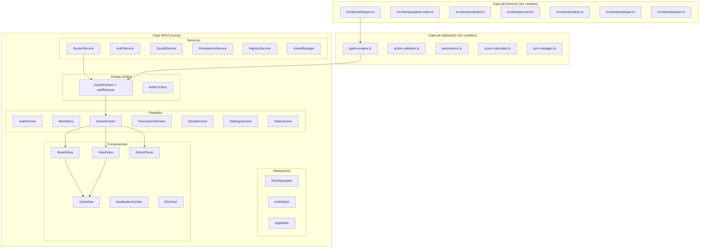
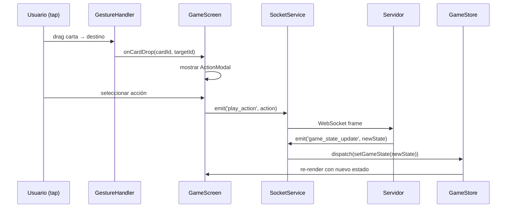

# Design Document: React Native Game Migration

## Overview

Este documento describe el diseño técnico para migrar Casino 21 de React web a React Native con Expo. La estrategia central es **preservar intacta la capa de dominio y aplicación** (`src/domain/` y `src/application/`) y construir una nueva capa de presentación móvil bajo `src/mobile/` que reemplaza únicamente los componentes web.

La arquitectura sigue un patrón de capas estricto:

```
src/domain/        ← Sin cambios (lógica de negocio pura)
src/application/   ← Sin cambios (motor de juego, validación, persistencia)
src/mobile/        ← Nueva capa de presentación React Native
```

El servidor Socket.IO y la base de datos Supabase permanecen sin cambios; solo cambia el cliente.

---

## Architecture

### Diagrama de capas



### Flujo de datos principal



---

## Components and Interfaces

### Estructura de directorios

```
src/mobile/
├── assets/
│   ├── cards/          # sprites de cartas (PNG)
│   ├── sounds/         # efectos de sonido (MP3/AAC)
│   └── fonts/          # fuentes personalizadas
├── components/
│   ├── CardView.tsx
│   ├── BoardView.tsx
│   ├── HandView.tsx
│   ├── ActionPanel.tsx
│   ├── NotificationCenter.tsx
│   ├── Timer.tsx
│   └── EloChart.tsx
├── screens/
│   ├── AuthScreen.tsx
│   ├── MainMenu.tsx
│   ├── GameScreen.tsx
│   ├── TournamentScreen.tsx
│   ├── SocialScreen.tsx
│   ├── SettingsScreen.tsx
│   └── StatsScreen.tsx
├── navigation/
│   ├── RootNavigator.tsx
│   ├── AuthStack.tsx
│   └── AppStack.tsx
├── store/
│   ├── GameContext.tsx
│   ├── gameReducer.ts
│   └── AuthContext.tsx
├── services/
│   ├── socketService.ts
│   ├── authService.ts
│   ├── socialService.ts
│   ├── persistenceService.ts
│   ├── hapticsService.ts
│   └── assetManager.ts
├── hooks/
│   ├── useGame.ts
│   ├── useAuth.ts
│   ├── useSocket.ts
│   └── useSocial.ts
└── utils/
    ├── cardUtils.ts
    └── platformUtils.ts
```

### Interfaces de servicios clave

```typescript
// socketService.ts
interface MobileSocketService {
  connect(token: string): Promise<Socket>;
  disconnect(): void;
  emit(event: string, data: unknown): void;
  on(event: string, handler: (data: unknown) => void): void;
  off(event: string): void;
  reconnect(roomId: string): Promise<void>;
}

// persistenceService.ts
interface PersistenceService {
  saveRoomId(roomId: string): Promise<void>;
  getRoomId(): Promise<string | null>;
  clearRoomId(): Promise<void>;
  savePreferences(prefs: UserPreferences): Promise<void>;
  getPreferences(): Promise<UserPreferences>;
}

interface UserPreferences {
  soundEnabled: boolean;
  hapticsEnabled: boolean;
  volume: number;
}

// hapticsService.ts
interface HapticsService {
  impactLight(): void;
  notificationSuccess(): void;
}
```

### Componentes principales

**CardView**
```typescript
interface CardViewProps {
  card: Card;
  selected?: boolean;
  onPress?: (card: Card) => void;
  onLongPress?: (card: Card) => void;
  draggable?: boolean;
  size?: 'small' | 'medium' | 'large';
}
```

**BoardView**
```typescript
interface BoardViewProps {
  board: Board;
  selectedCardIds: string[];
  onCardPress: (card: Card) => void;
  isMyTurn: boolean;
}
```

**HandView**
```typescript
interface HandViewProps {
  cards: Card[];
  selectedCardId: string | null;
  onCardSelect: (card: Card) => void;
  onCardDrop: (cardId: string, targetId: string) => void;
  disabled: boolean;
}
```

**ActionPanel**
```typescript
interface ActionPanelProps {
  validActions: Action[];
  selectedHandCard: Card | null;
  selectedBoardCards: Card[];
  onActionSelect: (action: Action) => void;
  onCancel: () => void;
}
```

---

## Data Models

Los modelos de datos del dominio se reutilizan sin cambios. Los modelos nuevos son exclusivos de la capa móvil:

### GameState (existente, sin cambios)

```typescript
// src/domain/game-state.ts — reutilizado directamente
interface GameState {
  id: string;
  mode: GameMode;          // '1v1' | '2v2'
  phase: GamePhase;        // 'dealing' | 'playing' | 'scoring' | 'completed'
  players: readonly Player[];
  teams: readonly Team[];
  board: Board;
  deck: Deck;
  currentTurnPlayerIndex: number;
  turnCount: number;
  roundCount: number;
  lastAction?: string;
  lastPlayerToTakeId?: string;
  winnerId?: string;
  lastScoreBreakdown?: readonly ScoreBreakdown[];
}
```

### Estado global móvil (nuevo)

```typescript
// store/gameReducer.ts
interface MobileGameState {
  gameState: GameState | null;
  localPlayerId: string | null;
  error: string | null;
  timeRemaining: number;
  disconnectionMessage: string | null;
}

type GameAction =
  | { type: 'SET_GAME_STATE'; payload: GameState }
  | { type: 'SET_LOCAL_PLAYER_ID'; payload: string }
  | { type: 'SET_ERROR'; payload: string }
  | { type: 'CLEAR_ERROR' }
  | { type: 'SET_TIME_REMAINING'; payload: number }
  | { type: 'SET_DISCONNECTION_MESSAGE'; payload: string | null };
```

### Preferencias de usuario (nuevo)

```typescript
interface UserPreferences {
  soundEnabled: boolean;
  hapticsEnabled: boolean;
  volume: number;  // 0.0 - 1.0
}
```

### Configuración de navegación (nuevo)

```typescript
type RootStackParamList = {
  Auth: undefined;
  MainMenu: undefined;
  Game: { roomId: string };
  Tournament: { tournamentId?: string };
  Social: undefined;
  Settings: undefined;
  Stats: { playerId: string };
};
```

---

## Correctness Properties

*A property is a characteristic or behavior that should hold true across all valid executions of a system — essentially, a formal statement about what the system should do. Properties serve as the bridge between human-readable specifications and machine-verifiable correctness guarantees.*

### Property 1: Conservación de 52 cartas

*For any* estado de juego válido procesado por el motor de juego, la suma de cartas en el mazo + tablero + formaciones + cartas cantadas + manos de jugadores + cartas recogidas por jugadores/equipos SHALL ser siempre 52.

**Validates: Requirements 1.4**

---

### Property 2: Round-trip de serialización del estado

*For any* estado de juego válido, serializar con `saveGame` y luego deserializar con `loadGame` SHALL producir un estado estructuralmente equivalente (mismas cartas, misma fase, mismos jugadores).

**Validates: Requirements 1.5**

---

### Property 3: Acciones del motor producen resultados deterministas

*For any* estado de juego y acción válida, aplicar la misma acción al mismo estado SHALL producir siempre el mismo estado resultante (sin aleatoriedad en la ejecución de acciones).

**Validates: Requirements 1.2**

---

### Property 4: Reconexión restaura el estado de sala

*For any* `roomId` guardado en `AsyncStorage` y sesión de usuario activa, al iniciar la app con ese `roomId`, el `SocketService` SHALL emitir `join_room` con ese `roomId` y el servidor SHALL responder con el estado actual de la sala.

**Validates: Requirements 9.3, 5.5**

---

### Property 5: Persistencia de preferencias round-trip

*For any* objeto `UserPreferences`, guardarlo con `savePreferences` y recuperarlo con `getPreferences` SHALL producir un objeto con los mismos valores.

**Validates: Requirements 9.4**

---

### Property 6: Gestos deshabilitados fuera del turno

*For any* estado de juego donde `currentTurnPlayerIndex` no corresponde al jugador local, todos los gestos de tap y drag sobre cartas SHALL ser ignorados (no emitir acciones al servidor).

**Validates: Requirements 4.7**

---

### Property 7: Validación de entrada vacía en autenticación

*For any* string compuesto únicamente de espacios en blanco como email o contraseña, el `AuthService` SHALL rechazar el intento de autenticación sin llamar al servidor.

**Validates: Requirements 6.5**

---

### Property 8: Actualización de estado sin mutación local

*For any* acción del jugador enviada al servidor, el `GameStore` SHALL mantener el estado anterior hasta recibir `game_state_update` del servidor, sin aplicar mutaciones optimistas locales.

**Validates: Requirements 8.2**

---

### Property 9: Formato de mensajes con timestamp y remitente

*For any* mensaje de chat en el sistema social, la función de renderizado SHALL producir una cadena que contenga tanto el timestamp como el nombre del remitente.

**Validates: Requirements 10.2**

---

### Property 10: Limpieza de roomId ante fallo de reconexión

*For any* `roomId` guardado, si el servidor responde con error al intentar `join_room`, el `PersistenceService` SHALL eliminar ese `roomId` de `AsyncStorage`.

**Validates: Requirements 9.5**

---

### Property 11: Respeto de preferencias de sonido y haptics

*For any* configuración de `UserPreferences` donde `soundEnabled` es `false` o `hapticsEnabled` es `false`, los servicios `AssetManager` y `HapticsService` respectivamente SHALL no invocar las APIs de `expo-av` ni `expo-haptics` durante cualquier interacción del juego.

**Validates: Requirements 11.6, 11.7**

---

## Error Handling

### Errores de red y Socket.IO

| Escenario | Comportamiento |
|-----------|---------------|
| `connect_error` | Reintentar con backoff, mostrar banner "Reconectando..." |
| Desconexión en partida | Mantener estado local, mostrar `disconnectionMessage`, reconectar automáticamente |
| Timeout de reconexión (>30s en background) | Desconectar limpiamente, al volver al foreground reconectar y emitir `join_room` |
| Error `join_room` del servidor | Limpiar `roomId` de AsyncStorage, navegar a MainMenu |

### Errores de autenticación

| Escenario | Comportamiento |
|-----------|---------------|
| Credenciales incorrectas | Mostrar mensaje en español: "Email o contraseña incorrectos" |
| Token expirado | Refrescar automáticamente con refresh token, transparente al usuario |
| Sin conexión al iniciar sesión | Mostrar "Sin conexión a internet" |
| Sesión inválida en AsyncStorage | Limpiar sesión, redirigir a AuthScreen |

### Errores del motor de juego

Los errores del `GameEngine` son `ErrorCode` tipados. La capa móvil los mapea a mensajes en español:

```typescript
const ERROR_MESSAGES: Record<ErrorCode, string> = {
  NOT_YOUR_TURN: 'No es tu turno',
  CARD_NOT_IN_HAND: 'Carta no disponible',
  INVALID_ACTION: 'Jugada no válida',
  CARD_PROTECTED: 'Esa carta está protegida',
  INVALID_FORMATION_SUM: 'La suma de la formación no es válida',
  FORMATION_NOT_FOUND: 'Formación no encontrada',
  INVALID_STATE: 'Estado de juego inválido',
  INVALID_CARD: 'Carta inválida',
  DECK_EMPTY: 'El mazo está vacío',
};
```

### Errores de assets

- Si un asset de carta no carga, mostrar un placeholder con el valor y palo en texto.
- Si `expo-av` falla al cargar un sonido, omitir silenciosamente (no bloquear el juego).
- Si `expo-haptics` no está disponible (simulador), omitir silenciosamente.

---

## Testing Strategy

### Enfoque dual: Unit tests + Property-based tests

Se utilizan dos tipos de tests complementarios:

- **Unit tests**: verifican ejemplos concretos, casos borde y condiciones de error.
- **Property-based tests**: verifican propiedades universales sobre rangos amplios de inputs generados aleatoriamente.

Los unit tests son útiles para casos específicos e integraciones. Los property tests cubren la corrección general del sistema con mínimo esfuerzo de escritura.

### Librería de property-based testing

Se utilizará **`fast-check`** (compatible con Jest/Vitest y TypeScript):

```bash
npm install --save-dev fast-check
```

Cada property test debe ejecutar **mínimo 100 iteraciones** (configurado con `{ numRuns: 100 }`).

### Etiquetado de tests

Cada property test debe incluir un comentario de trazabilidad:

```typescript
// Feature: react-native-game-migration, Property 1: Conservación de 52 cartas
it('conserva 52 cartas en cualquier estado válido', () => {
  fc.assert(fc.property(arbitraryGameState(), (state) => {
    // ...
  }), { numRuns: 100 });
});
```

### Tests por capa

**Dominio y aplicación (sin cambios, tests existentes)**
- Los tests existentes de `src/domain/` y `src/application/` deben seguir pasando sin modificación.
- Confirmar que no hay dependencias de APIs de navegador en esos módulos.

**Servicios móviles (unit tests)**
- `persistenceService`: mock de `AsyncStorage`, verificar save/load de `roomId` y preferencias.
- `authService`: mock de `@supabase/supabase-js`, verificar flujo de login/logout/refresh.
- `socketService`: mock de `socket.io-client`, verificar reconexión automática y emisión de eventos.
- `hapticsService`: mock de `expo-haptics`, verificar que se omite cuando está deshabilitado.

**Store (unit tests + property tests)**
- Unit: verificar que cada acción del reducer produce el estado esperado.
- Property (Property 8): para cualquier secuencia de acciones `SET_GAME_STATE`, el estado nunca debe mutar el estado anterior.

**Componentes (unit tests con React Native Testing Library)**
- `CardView`: renderiza correctamente con diferentes props, dispara callbacks en tap/long-press.
- `HandView`: renderiza todas las cartas, deshabilita gestos cuando `disabled=true`.
- `BoardView`: muestra cartas sueltas, formaciones y cartas cantadas.
- `ActionPanel`: muestra solo las acciones válidas recibidas como props.

**Property tests (fast-check)**

Cada propiedad del documento tiene exactamente un property test:

| Property | Test |
|----------|------|
| P1: Conservación 52 cartas | Generar estado aleatorio, ejecutar acción aleatoria válida, contar cartas |
| P2: Round-trip serialización | Generar estado aleatorio, `saveGame` → `loadGame`, comparar |
| P3: Determinismo del motor | Generar estado + acción, ejecutar dos veces, comparar resultados |
| P4: Reconexión restaura sala | Mock de AsyncStorage con roomId, simular inicio de app, verificar `join_room` |
| P5: Round-trip preferencias | Generar `UserPreferences` aleatorio, save → load, comparar |
| P6: Gestos deshabilitados | Generar estado donde no es turno local, simular tap, verificar 0 emisiones |
| P7: Validación entrada vacía | Generar strings de solo espacios, verificar rechazo sin llamada a Supabase |
| P8: Sin mutación optimista | Generar acción, verificar que el store no cambia hasta recibir `game_state_update` |
| P9: Formato de mensajes | Generar mensajes aleatorios, verificar que el render contiene timestamp y remitente |
| P10: Limpieza roomId en fallo | Simular error de servidor en `join_room`, verificar que AsyncStorage queda vacío |

### Configuración de tests

```typescript
// jest.config.js (para la capa móvil)
module.exports = {
  preset: 'jest-expo',
  setupFilesAfterFramework: ['@testing-library/jest-native/extend-expect'],
  transformIgnorePatterns: [
    'node_modules/(?!((jest-)?react-native|@react-native(-community)?)|expo(nent)?|@expo(nent)?/.*|@expo-google-fonts/.*|react-navigation|@react-navigation/.*|@unimodules/.*|unimodules|sentry-expo|native-base|react-native-svg)'
  ]
};
```
