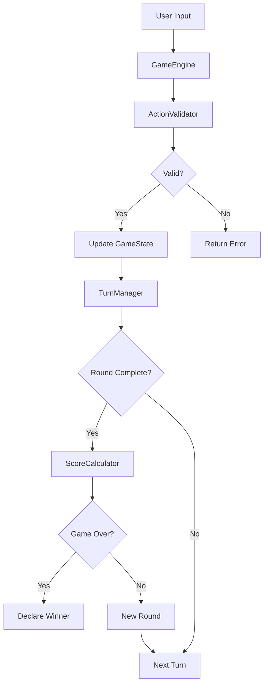

# Design Document: Casino 21 Card Game

## Overview

Casino 21 es un juego de cartas estratégico que requiere una arquitectura modular y bien estructurada para manejar mecánicas complejas como formaciones, virados, y reglas especiales de puntuación. El diseño se centra en la separación de responsabilidades entre la lógica del juego, el estado, y la presentación.

### Objetivos del Diseño

- **Modularidad**: Componentes independientes y reutilizables
- **Testabilidad**: Lógica de negocio separada de la interfaz
- **Extensibilidad**: Facilidad para agregar nuevas reglas o modos de juego
- **Mantenibilidad**: Código claro y bien documentado
- **Corrección**: Validación exhaustiva de reglas mediante property-based testing

### Tecnologías Propuestas

- **Lenguaje**: TypeScript (tipado estático, mejor mantenibilidad)
- **Testing**: Jest para unit tests, fast-check para property-based testing
- **Persistencia**: JSON para serialización del estado del juego
- **Interfaz**: Separación clara entre lógica y UI (permite múltiples frontends)

## Architecture

### Arquitectura de Capas

El sistema se organiza en tres capas principales:

```
┌─────────────────────────────────────┐
│     Presentation Layer (UI)         │
│  - Console Interface                │
│  - Web Interface (future)           │
└─────────────────────────────────────┘
              ↓ ↑
┌─────────────────────────────────────┐
│      Application Layer              │
│  - GameEngine                       │
│  - TurnManager                      │
│  - ActionValidator                  │
└─────────────────────────────────────┘
              ↓ ↑
┌─────────────────────────────────────┐
│       Domain Layer                  │
│  - GameState                        │
│  - Card, Deck, Board                │
│  - Player, Team                     │
│  - ScoreCalculator                  │
│  - Formation                        │
└─────────────────────────────────────┘
```

### Flujo de Datos



### Componentes Principales

1. **GameEngine**: Orquestador principal del juego
2. **GameState**: Contenedor inmutable del estado completo
3. **ActionValidator**: Valida todas las acciones antes de ejecutarlas
4. **TurnManager**: Gestiona el orden y flujo de turnos
5. **ScoreCalculator**: Calcula puntos según las reglas
6. **Formation**: Representa agrupaciones de cartas en el tablero

## Components and Interfaces

### GameEngine

Responsabilidad: Coordinar todas las operaciones del juego y mantener el ciclo de vida de una partida.

```typescript
interface GameEngine {
  // Inicialización
  startNewGame(mode: GameMode, playerNames: string[]): GameState;
  loadGame(savedState: SerializedGameState): GameState;
  
  // Acciones de juego
  playCard(playerId: string, cardId: string, action: Action): Result<GameState>;
  
  // Consultas
  getCurrentState(): GameState;
  getValidActions(playerId: string): Action[];
  
  // Persistencia
  saveGame(): SerializedGameState;
}

type GameMode = '1v1' | '2v2';

type Action = 
  | { type: 'llevar', targetCards: string[] }
  | { type: 'formar', targetCards: string[], formationValue: number }
  | { type: 'formarPar', formationId: string }
  | { type: 'cantar' }
  | { type: 'colocar' };
```

### GameState

Responsabilidad: Mantener el estado completo e inmutable del juego.

```typescript
interface GameState {
  readonly gameId: string;
  readonly mode: GameMode;
  readonly players: ReadonlyArray<Player>;
  readonly teams: ReadonlyArray<Team> | null; // null en modo 1v1
  readonly deck: Deck;
  readonly board: Board;
  readonly currentPlayerIndex: number;
  readonly currentRound: number;
  readonly phase: GamePhase;
  readonly winner: string | null;
}

type GamePhase = 'setup' | 'playing' | 'scoring' | 'finished';

interface Player {
  readonly id: string;
  readonly name: string;
  readonly hand: ReadonlyArray<Card>;
  readonly collectedCards: ReadonlyArray<Card>;
  readonly virados: number;
  readonly score: number;
  readonly teamId: string | null;
}

interface Team {
  readonly id: string;
  readonly playerIds: [string, string];
  readonly score: number;
  readonly collectedCards: ReadonlyArray<Card>;
  readonly virados: number;
}
```

### Card and Deck

Responsabilidad: Representar cartas individuales y el mazo completo.

```typescript
interface Card {
  readonly id: string;
  readonly suit: Suit;
  readonly rank: Rank;
  readonly value: number; // 1-13
}

type Suit = 'hearts' | 'diamonds' | 'clubs' | 'spades';
type Rank = 'A' | '2' | '3' | '4' | '5' | '6' | '7' | '8' | '9' | '10' | 'J' | 'Q' | 'K';

interface Deck {
  readonly cards: ReadonlyArray<Card>;
  readonly remainingCount: number;
  
  shuffle(): Deck;
  draw(count: number): { cards: Card[], remainingDeck: Deck };
}
```

### Board

Responsabilidad: Gestionar las cartas visibles en el tablero y las formaciones.

```typescript
interface Board {
  readonly cards: ReadonlyArray<Card>;
  readonly formations: ReadonlyArray<Formation>;
  readonly cantedCards: ReadonlyArray<CantedCard>;
  
  addCard(card: Card): Board;
  removeCards(cardIds: string[]): Board;
  addFormation(formation: Formation): Board;
  removeFormation(formationId: string): Board;
  isEmpty(): boolean;
}

interface Formation {
  readonly id: string;
  readonly cards: ReadonlyArray<Card>;
  readonly value: number;
  readonly createdBy: string; // playerId
  readonly createdAt: number; // round number
}

interface CantedCard {
  readonly card: Card;
  readonly cantedBy: string; // playerId
  readonly protectedUntilTurn: number;
}
```

### ActionValidator

Responsabilidad: Validar todas las acciones del jugador según las reglas del juego.

```typescript
interface ActionValidator {
  validateAction(
    state: GameState,
    playerId: string,
    cardId: string,
    action: Action
  ): ValidationResult;
  
  getValidActions(state: GameState, playerId: string, cardId: string): Action[];
}

type ValidationResult = 
  | { valid: true }
  | { valid: false, reason: string };

// Reglas de validación específicas
interface ValidationRules {
  canLlevar(card: Card, boardCards: Card[]): boolean;
  canFormar(card: Card, boardCards: Card[]): boolean;
  canFormarPar(card: Card, formation: Formation): boolean;
  canCantar(player: Player): boolean;
  mustTakeOwnFormation(player: Player, board: Board): boolean;
}
```

### TurnManager

Responsabilidad: Gestionar el orden de turnos y transiciones entre rondas.

```typescript
interface TurnManager {
  getNextPlayer(state: GameState): string; // playerId
  isRoundComplete(state: GameState): boolean;
  startNewRound(state: GameState): GameState;
  getTurnOrder(state: GameState): string[]; // playerIds in order
}
```

### ScoreCalculator

Responsabilidad: Calcular puntos al final de cada ronda según las reglas complejas.

```typescript
interface ScoreCalculator {
  calculateRoundScore(state: GameState): ScoreResult;
  applySpecialRules(currentScore: number, earnedPoints: Points): Points;
}

interface ScoreResult {
  readonly playerScores: Map<string, Points>;
  readonly teamScores: Map<string, Points> | null;
  readonly breakdown: ScoreBreakdown[];
}

interface Points {
  readonly mayoriaCartas: number;
  readonly mayoriaPicas: number;
  readonly diezDiamantes: number;
  readonly dosPicas: number;
  readonly ases: number;
  readonly virados: number;
  readonly total: number;
}

interface ScoreBreakdown {
  readonly playerId: string;
  readonly category: string;
  readonly points: number;
  readonly reason: string;
}
```

## Data Models

### Modelo de Dominio Completo

```typescript
// Enumeraciones y tipos básicos
enum GameMode {
  OneVsOne = '1v1',
  TwoVsTwo = '2v2'
}

enum GamePhase {
  Setup = 'setup',
  Playing = 'playing',
  Scoring = 'scoring',
  Finished = 'finished'
}

enum Suit {
  Hearts = 'hearts',
  Diamonds = 'diamonds',
  Clubs = 'clubs',
  Spades = 'spades'
}

enum Rank {
  Ace = 'A',
  Two = '2',
  Three = '3',
  Four = '4',
  Five = '5',
  Six = '6',
  Seven = '7',
  Eight = '8',
  Nine = '9',
  Ten = '10',
  Jack = 'J',
  Queen = 'Q',
  King = 'K'
}

// Tipos de resultado
type Result<T> = 
  | { success: true, value: T }
  | { success: false, error: GameError };

interface GameError {
  readonly code: ErrorCode;
  readonly message: string;
  readonly details?: any;
}

enum ErrorCode {
  InvalidAction = 'INVALID_ACTION',
  InvalidPlayer = 'INVALID_PLAYER',
  NotPlayerTurn = 'NOT_PLAYER_TURN',
  InvalidCard = 'INVALID_CARD',
  InsufficientAces = 'INSUFFICIENT_ACES',
  InvalidFormation = 'INVALID_FORMATION',
  GameNotInProgress = 'GAME_NOT_IN_PROGRESS',
  InvalidGameState = 'INVALID_GAME_STATE'
}
```

### Serialización para Persistencia

```typescript
interface SerializedGameState {
  readonly version: string; // para versionado del formato
  readonly gameId: string;
  readonly mode: GameMode;
  readonly players: SerializedPlayer[];
  readonly teams: SerializedTeam[] | null;
  readonly deck: SerializedDeck;
  readonly board: SerializedBoard;
  readonly currentPlayerIndex: number;
  readonly currentRound: number;
  readonly phase: GamePhase;
  readonly winner: string | null;
  readonly timestamp: number;
}

// Interfaces de serialización simplificadas
interface SerializedPlayer {
  id: string;
  name: string;
  handCardIds: string[];
  collectedCardIds: string[];
  virados: number;
  score: number;
  teamId: string | null;
}

interface SerializedDeck {
  cardIds: string[];
}

interface SerializedBoard {
  cardIds: string[];
  formations: SerializedFormation[];
  cantedCards: SerializedCantedCard[];
}

interface SerializedFormation {
  id: string;
  cardIds: string[];
  value: number;
  createdBy: string;
  createdAt: number;
}

interface SerializedCantedCard {
  cardId: string;
  cantedBy: string;
  protectedUntilTurn: number;
}
```

### Invariantes del Modelo

El sistema debe mantener los siguientes invariantes en todo momento:

1. **Conservación de cartas**: La suma de cartas en manos, tablero, colecciones y mazo siempre debe ser 52
2. **Unicidad de cartas**: Ninguna carta puede existir en dos lugares simultáneamente
3. **Turno válido**: `currentPlayerIndex` siempre debe estar en el rango válido de jugadores
4. **Formaciones válidas**: Toda formación debe sumar exactamente su valor declarado
5. **Ases cantados**: Solo se pueden cantar ases si el jugador tiene al menos 2 en su mano
6. **Puntuación acotada**: Los puntos nunca pueden ser negativos
7. **Equipos válidos**: En modo 2v2, cada jugador debe pertenecer a exactamente un equipo
8. **Ronda válida**: El número de ronda debe ser >= 1 y <= número máximo de rondas posibles


## Correctness Properties

*A property is a characteristic or behavior that should hold true across all valid executions of a system-essentially, a formal statement about what the system should do. Properties serve as the bridge between human-readable specifications and machine-verifiable correctness guarantees.*

### Property 1: Game initialization creates valid state

*For any* game mode (1v1 or 2v2) and player names, initializing a new game should produce a valid game state where: the deck contains all 52 unique cards, each player has exactly 4 cards in hand, the board has exactly 4 cards, and the current player index is within valid range.

**Validates: Requirements 1.1, 1.2, 1.3, 1.4, 1.5**

### Property 2: Card conservation invariant

*For any* game state at any point during the game, the total number of cards across all locations (deck + all player hands + board + all player collections + all formations) must equal exactly 52, and no card can appear in multiple locations simultaneously.

**Validates: Requirements 1.2, 3.2, 3.3, 4.4**

### Property 3: Turn progression maintains sequential order

*For any* valid game state during play, advancing to the next turn should result in the current player index incrementing by 1 (modulo number of players), and in 2v2 mode, consecutive turns should alternate between teams.

**Validates: Requirements 2.1, 2.2, 2.4**

### Property 4: Only current player can perform actions

*For any* game state and any player ID that is not the current player, attempting to perform any action should result in a validation error with code NOT_PLAYER_TURN.

**Validates: Requirements 2.3, 12.3**

### Property 5: Round transitions when hands are empty

*For any* game state where all players have empty hands and the deck has sufficient cards and no player has reached 21 points, the game should transition to a new round where each player receives 4 new cards.

**Validates: Requirements 2.5, 11.3, 11.4, 11.5**

### Property 6: Llevar action transfers matching cards correctly

*For any* game state, player, and card from the player's hand, when performing a llevar action, all cards on the board with matching value should be removed from the board and added to the player's collection, and the played card should be removed from the player's hand.

**Validates: Requirements 3.1, 3.2, 3.3, 3.5, 14.1**

### Property 7: Card placement when no matches exist

*For any* game state, player, and card from the player's hand where no cards on the board match the card's value, playing the card should result in the card being added to the board and removed from the player's hand.

**Validates: Requirements 3.4**

### Property 8: Formation creation requires valid sum

*For any* game state, player, card from hand, and set of board cards, creating a formation is valid if and only if the sum of the board cards' values equals the hand card's value, and after creation, the formation should be registered with the creating player's ID.

**Validates: Requirements 4.1, 4.3, 14.2**

### Property 9: Formations can be taken by any player

*For any* game state with an existing formation of value V, any player with a card of value V in their hand should be able to take the formation, resulting in all formation cards being transferred to that player's collection.

**Validates: Requirements 4.4, 4.5, 5.3**

### Property 10: Forming pairs adds cards to formations

*For any* game state with an existing formation of value V, when a player plays a card of value V to form a pair, the formation should be updated to include the new card while maintaining the same formation ID and value.

**Validates: Requirements 5.1, 5.2**

### Property 11: Cantar requires two aces

*For any* game state and player, the cantar action is valid if and only if the player has at least 2 aces in their hand, and attempting to cantar with fewer than 2 aces should result in a validation error with code INSUFFICIENT_ACES.

**Validates: Requirements 6.1, 6.4, 6.5, 14.3**

### Property 12: Canted aces are protected

*For any* game state where a player cants an ace, the ace should be placed on the board in the cantedCards collection with protection metadata, and other players should not be able to take that ace until the canting player's next turn has passed.

**Validates: Requirements 6.2, 6.3**

### Property 13: Virado awarded for clearing board

*For any* game state where a player's action results in the board becoming empty (no cards and no formations) and the game is not finished, the player should receive a virado (virado count incremented by 1).

**Validates: Requirements 7.1, 7.2, 7.3**

### Property 14: Score calculation follows all rules

*For any* completed round state, the score calculator should award points according to all rules: 3 points for card majority, 1 point for spade majority, 2 points for 10 of diamonds, 1 point for 2 of spades, 1 point per ace collected, and 1 point per virado obtained.

**Validates: Requirements 8.1, 8.2, 8.3, 8.4, 8.5, 8.6, 8.7**

### Property 15: Score accumulation is additive

*For any* sequence of rounds in a game, the total score for each player or team should equal the sum of points earned in all completed rounds.

**Validates: Requirements 8.8, 15.2**

### Property 16: Special scoring rules at 17 points

*For any* round scoring where a player or team has exactly 17 points before scoring, only points for card majority and spade majority should be awarded (no points for special cards, aces, or virados).

**Validates: Requirements 9.1**

### Property 17: Special scoring rules at 18-19 points

*For any* round scoring where a player or team has 18 or 19 points before scoring, only points for card majority should be awarded (no other point categories).

**Validates: Requirements 9.2, 9.3**

### Property 18: Special scoring rules at 20 points

*For any* round scoring where a player or team has exactly 20 points before scoring, only points for spade majority should be awarded (no other point categories).

**Validates: Requirements 9.4**

### Property 19: Victory at 21 or more points

*For any* game state after scoring, if a player or team has 21 or more points, the game should transition to finished phase with that player or team declared as winner.

**Validates: Requirements 10.1, 10.2, 10.3**

### Property 20: Game ends when deck insufficient

*For any* game state where the deck has fewer cards than needed for a new round (fewer than 4 × number of players) and no player has reached 21 points, the game should end with the player or team having the highest score declared as winner.

**Validates: Requirements 11.6**

### Property 21: Invalid actions return appropriate errors

*For any* invalid action attempt (wrong turn, invalid card, invalid formation sum, insufficient aces for cantar, etc.), the game engine should return a Result with success=false and an appropriate error code and message, and the game state should remain unchanged.

**Validates: Requirements 12.5, 14.4**

### Property 22: Each turn consumes exactly one card

*For any* valid turn action, after the action is completed, the acting player's hand should have exactly one fewer card than before the action.

**Validates: Requirements 14.5**

### Property 23: Game state serialization round trip

*For any* valid game state, serializing the state to JSON and then deserializing it should produce an equivalent game state with all properties preserved (cards in same locations, same scores, same turn order, same formations, etc.).

**Validates: Requirements 15.6, 15.7**

## Error Handling

### Error Categories

El sistema maneja errores en tres categorías principales:

1. **Validation Errors**: Errores de validación de reglas del juego
2. **State Errors**: Errores de estado inválido o inconsistente
3. **System Errors**: Errores de sistema (serialización, etc.)

### Error Codes and Handling

```typescript
enum ErrorCode {
  // Validation Errors
  INVALID_ACTION = 'INVALID_ACTION',
  NOT_PLAYER_TURN = 'NOT_PLAYER_TURN',
  INVALID_CARD = 'INVALID_CARD',
  CARD_NOT_IN_HAND = 'CARD_NOT_IN_HAND',
  NO_MATCHING_CARDS = 'NO_MATCHING_CARDS',
  INVALID_FORMATION_SUM = 'INVALID_FORMATION_SUM',
  INSUFFICIENT_ACES = 'INSUFFICIENT_ACES',
  FORMATION_NOT_FOUND = 'FORMATION_NOT_FOUND',
  CANTED_CARD_PROTECTED = 'CANTED_CARD_PROTECTED',
  
  // State Errors
  GAME_NOT_IN_PROGRESS = 'GAME_NOT_IN_PROGRESS',
  GAME_ALREADY_FINISHED = 'GAME_ALREADY_FINISHED',
  INVALID_GAME_STATE = 'INVALID_GAME_STATE',
  PLAYER_NOT_FOUND = 'PLAYER_NOT_FOUND',
  
  // System Errors
  SERIALIZATION_ERROR = 'SERIALIZATION_ERROR',
  DESERIALIZATION_ERROR = 'DESERIALIZATION_ERROR',
  INVALID_GAME_VERSION = 'INVALID_GAME_VERSION'
}
```

### Error Handling Strategy

1. **Fail Fast**: Validar todas las precondiciones antes de modificar el estado
2. **Immutability**: Nunca modificar el estado existente; siempre crear nuevo estado
3. **Descriptive Messages**: Cada error debe incluir un mensaje claro en español
4. **Error Recovery**: La UI debe permitir al usuario corregir errores y reintentar
5. **Logging**: Todos los errores deben ser registrados para debugging

### Error Response Format

```typescript
interface GameError {
  readonly code: ErrorCode;
  readonly message: string;
  readonly details?: {
    playerId?: string;
    cardId?: string;
    expectedValue?: number;
    actualValue?: number;
    [key: string]: any;
  };
}

// Ejemplo de uso
const error: GameError = {
  code: ErrorCode.INVALID_FORMATION_SUM,
  message: 'La suma de las cartas seleccionadas (8) no coincide con el valor de la carta jugada (7)',
  details: {
    playerId: 'player-1',
    cardId: 'card-7-hearts',
    expectedValue: 7,
    actualValue: 8,
    selectedCards: ['card-3-clubs', 'card-5-diamonds']
  }
};
```

### Invariant Validation

El sistema debe validar invariantes críticos después de cada operación:

```typescript
function validateInvariants(state: GameState): ValidationResult {
  // 1. Card conservation
  const totalCards = countAllCards(state);
  if (totalCards !== 52) {
    return { valid: false, reason: `Card count is ${totalCards}, expected 52` };
  }
  
  // 2. No duplicate cards
  const allCardIds = getAllCardIds(state);
  const uniqueCardIds = new Set(allCardIds);
  if (allCardIds.length !== uniqueCardIds.size) {
    return { valid: false, reason: 'Duplicate cards detected' };
  }
  
  // 3. Valid player index
  if (state.currentPlayerIndex < 0 || state.currentPlayerIndex >= state.players.length) {
    return { valid: false, reason: 'Invalid current player index' };
  }
  
  // 4. Formation sums are correct
  for (const formation of state.board.formations) {
    const sum = formation.cards.reduce((acc, card) => acc + card.value, 0);
    if (sum !== formation.value) {
      return { valid: false, reason: `Formation ${formation.id} sum mismatch` };
    }
  }
  
  // 5. Scores are non-negative
  for (const player of state.players) {
    if (player.score < 0) {
      return { valid: false, reason: `Player ${player.id} has negative score` };
    }
  }
  
  return { valid: true };
}
```

## Testing Strategy

### Dual Testing Approach

El proyecto utilizará una estrategia de testing dual que combina unit tests y property-based tests para lograr cobertura exhaustiva:

- **Unit Tests**: Verifican ejemplos específicos, casos edge, y condiciones de error
- **Property Tests**: Verifican propiedades universales a través de múltiples inputs generados

Ambos tipos de tests son complementarios y necesarios:
- Los unit tests capturan bugs concretos y documentan comportamientos específicos
- Los property tests verifican corrección general y descubren casos edge inesperados

### Property-Based Testing Configuration

**Librería**: fast-check (para TypeScript/JavaScript)

**Configuración**:
- Mínimo 100 iteraciones por property test (debido a la naturaleza aleatoria)
- Cada property test debe referenciar su propiedad del documento de diseño
- Formato de tag: `Feature: casino-21-card-game, Property {número}: {texto de la propiedad}`

**Ejemplo de Property Test**:

```typescript
import fc from 'fast-check';

describe('Feature: casino-21-card-game, Property 2: Card conservation invariant', () => {
  it('should maintain exactly 52 cards across all locations', () => {
    fc.assert(
      fc.property(
        gameStateArbitrary(),
        actionArbitrary(),
        (initialState, action) => {
          // Arrange
          const totalCardsBefore = countAllCards(initialState);
          expect(totalCardsBefore).toBe(52);
          
          // Act
          const result = gameEngine.playCard(
            initialState.players[initialState.currentPlayerIndex].id,
            action.cardId,
            action
          );
          
          // Assert
          if (result.success) {
            const totalCardsAfter = countAllCards(result.value);
            expect(totalCardsAfter).toBe(52);
            
            // Also verify no duplicates
            const allCardIds = getAllCardIds(result.value);
            const uniqueCardIds = new Set(allCardIds);
            expect(allCardIds.length).toBe(uniqueCardIds.size);
          }
        }
      ),
      { numRuns: 100 }
    );
  });
});
```

### Generators (Arbitraries)

Para property-based testing, necesitamos generators que produzcan datos válidos:

```typescript
// Generator para cartas
const cardArbitrary = (): fc.Arbitrary<Card> => {
  return fc.record({
    id: fc.string(),
    suit: fc.constantFrom('hearts', 'diamonds', 'clubs', 'spades'),
    rank: fc.constantFrom('A', '2', '3', '4', '5', '6', '7', '8', '9', '10', 'J', 'Q', 'K'),
    value: fc.integer({ min: 1, max: 13 })
  });
};

// Generator para estados de juego válidos
const gameStateArbitrary = (): fc.Arbitrary<GameState> => {
  return fc.record({
    gameId: fc.uuid(),
    mode: fc.constantFrom('1v1', '2v2'),
    players: fc.array(playerArbitrary(), { minLength: 2, maxLength: 4 }),
    // ... más campos
  }).chain(state => {
    // Asegurar que el estado cumple invariantes
    return fc.constant(normalizeGameState(state));
  });
};

// Generator para acciones válidas dado un estado
const validActionArbitrary = (state: GameState): fc.Arbitrary<Action> => {
  const currentPlayer = state.players[state.currentPlayerIndex];
  const validActions = actionValidator.getValidActions(state, currentPlayer.id);
  return fc.constantFrom(...validActions);
};
```

### Unit Testing Strategy

Los unit tests deben enfocarse en:

1. **Ejemplos Específicos**: Casos concretos que documentan comportamiento esperado
2. **Casos Edge**: Situaciones límite (tablero vacío, última carta, empates, etc.)
3. **Condiciones de Error**: Verificar que errores se manejan correctamente
4. **Integración**: Verificar que componentes trabajan juntos correctamente

**Ejemplo de Unit Test**:

```typescript
describe('GameEngine - Llevar Action', () => {
  it('should collect all matching cards from board', () => {
    // Arrange
    const state = createTestGameState({
      board: {
        cards: [
          createCard('7', 'hearts'),
          createCard('7', 'clubs'),
          createCard('3', 'diamonds')
        ]
      },
      currentPlayer: {
        hand: [createCard('7', 'spades')]
      }
    });
    
    // Act
    const result = gameEngine.playCard(
      state.players[0].id,
      'card-7-spades',
      { type: 'llevar', targetCards: ['card-7-hearts', 'card-7-clubs'] }
    );
    
    // Assert
    expect(result.success).toBe(true);
    expect(result.value.board.cards).toHaveLength(1);
    expect(result.value.board.cards[0].rank).toBe('3');
    expect(result.value.players[0].collectedCards).toHaveLength(3);
  });
  
  it('should place card on board when no matches exist', () => {
    // Arrange
    const state = createTestGameState({
      board: {
        cards: [createCard('3', 'diamonds')]
      },
      currentPlayer: {
        hand: [createCard('7', 'spades')]
      }
    });
    
    // Act
    const result = gameEngine.playCard(
      state.players[0].id,
      'card-7-spades',
      { type: 'colocar' }
    );
    
    // Assert
    expect(result.success).toBe(true);
    expect(result.value.board.cards).toHaveLength(2);
    expect(result.value.board.cards.some(c => c.rank === '7')).toBe(true);
  });
});
```

### Test Coverage Goals

- **Line Coverage**: Mínimo 90%
- **Branch Coverage**: Mínimo 85%
- **Function Coverage**: 100% de funciones públicas
- **Property Coverage**: 100% de las propiedades definidas en este documento

### Test Organization

```
tests/
├── unit/
│   ├── game-engine.test.ts
│   ├── score-calculator.test.ts
│   ├── action-validator.test.ts
│   ├── turn-manager.test.ts
│   └── models/
│       ├── card.test.ts
│       ├── deck.test.ts
│       └── board.test.ts
├── property/
│   ├── game-initialization.property.test.ts
│   ├── card-conservation.property.test.ts
│   ├── turn-management.property.test.ts
│   ├── llevar-actions.property.test.ts
│   ├── formation-actions.property.test.ts
│   ├── scoring.property.test.ts
│   └── serialization.property.test.ts
├── integration/
│   ├── full-game-flow.test.ts
│   └── multi-round-scenarios.test.ts
└── helpers/
    ├── test-data-builders.ts
    ├── arbitraries.ts
    └── assertions.ts
```

### Continuous Testing

- Todos los tests deben ejecutarse en cada commit (CI/CD)
- Property tests con 100 iteraciones en desarrollo, 1000 en CI
- Tests de regresión para bugs encontrados
- Mutation testing para verificar calidad de los tests

