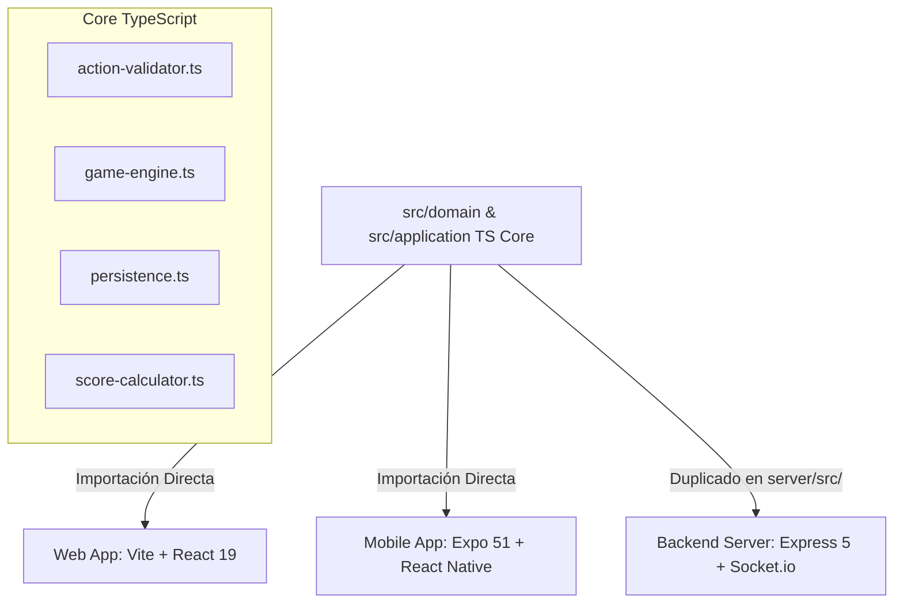

# Especificación Técnica: Reutilización de la Lógica de Negocio en Android (JS/TS Core)

Esta especificación detalla cómo integrar y reutilizar la lógica de negocio core de **Kasino21** en la aplicación móvil **Android (React Native + Expo)**. Se cubre la especificación de los siguientes archivos de la capa de aplicación:

1. [action-validator.ts](file:///c:/Users/angel/Desktop/Develop/Web%20all%20projects/casino-21-card-game/src/application/action-validator.ts) -> Validador de Jugadas
2. [game-engine.ts](file:///c:/Users/angel/Desktop/Develop/Web%20all%20projects/casino-21-card-game/src/application/game-engine.ts) -> Motor de Estado de Juego
3. [persistence.ts](file:///c:/Users/angel/Desktop/Develop/Web%20all%20projects/casino-21-card-game/src/application/persistence.ts) -> Serialización/Deserialización del Estado
4. [score-calculator.ts](file:///c:/Users/angel/Desktop/Develop/Web%20all%20projects/casino-21-card-game/src/application/score-calculator.ts) -> Calculador de Puntajes y Mayorías

---

## 1. Estrategia de Código Compartido (Zero-Duplication)

Dado que React Native ejecuta JavaScript/TypeScript de forma nativa a través del motor **Hermes** en Android, **NO se debe rescribir la lógica de negocio en lenguajes nativos (Java/Kotlin)**. Los mismos archivos TypeScript de la carpeta `/src/application/*` y `/src/domain/*` son directamente importados y consumidos por la aplicación móvil.

### 1.1 Diagrama de Reutilización de Lógica


### 1.2 Configuración del Transpilador (TS Config)
Para facilitar las importaciones en la app móvil sin usar rutas relativas complejas (e.g. `../../../../src/application`), se deben añadir aliases en el `tsconfig.json` del proyecto Expo:

```json
{
  "compilerOptions": {
    "baseUrl": ".",
    "paths": {
      "@domain/*": ["./src/domain/*"],
      "@application/*": ["./src/application/*"],
      "@components/*": ["./app/components/*"]
    }
  }
}
```

---

## 2. Adaptación y Uso de Cada Módulo en Android

### 2.1 [action-validator.ts](file:///c:/Users/angel/Desktop/Develop/Web%20all%20projects/casino-21-card-game/src/application/action-validator.ts)
Este validador se ejecuta en dos puntos estratégicos del cliente Android:
1. **Validación Optimizada Local (UX Instantánea)**:
   * Cuando el usuario arrastra una carta sobre un objetivo o presiona botones del panel de acciones, la UI móvil ejecuta `DefaultActionValidator.validate()` antes de enviar cualquier paquete por WebSocket.
   * Si la acción es inválida (e.g. intentar formar sin cartas que sumen el valor), la UI muestra de inmediato una advertencia visual y emite un sonido de error, evitando sobrecargar el socket y eliminando la latencia de red en jugadas fallidas.
2. **Filtrado de Acciones Disponibles**:
   * Al iniciar el turno, la UI móvil llama a `getValidActions()` para habilitar o deshabilitar visualmente las cartas de la mano y los botones de acción correspondientes.

### 2.2 [game-engine.ts](file:///c:/Users/angel/Desktop/Develop/Web%20all%20projects/casino-21-card-game/src/application/game-engine.ts)
El motor de juego coordina el ciclo de vida de la partida. En Android, su rol depende del modo de juego:
1. **Partidas Multijugador (Online)**:
   * El cliente es **pasivo**. El backend (servidor) es la autoridad y ejecuta el `GameEngine`.
   * El cliente Android recibe las actualizaciones de estado mediante WebSockets y simplemente renderiza el nuevo estado.
2. **Partidas de Bots / Práctica (Offline)**:
   * En Android, el juego contra bots (e.g., `isBot: true`) se ejecuta **localmente en el dispositivo** para permitir juego sin conexión.
   * El cliente instancia `DefaultGameEngine` y ejecuta las jugadas del jugador y las respuestas automáticas del bot usando la lógica del motor local.
   * **Temporizador de Turno**: En Android, el timeout de 30s se ejecuta en la UI. Si llega a cero, se invoca `getTimeoutAction()` localmente y se autodescarta la carta de menor valor aplicando la prioridad de negocio.

### 2.3 [persistence.ts](file:///c:/Users/angel/Desktop/Develop/Web%20all%20projects/casino-21-card-game/src/application/persistence.ts)
El archivo define funciones puras de serialización/deserialización. En Android, se adapta el destino de almacenamiento:
* **Web**: Usa `localStorage` para guardar el `roomId` o estados rápidos.
* **Android**: Se debe utilizar `@react-native-async-storage/async-storage` para persistir la partida de bots actual o la última partida online jugada (para reconexiones).

#### Código de Integración de Persistencia en Android:
```typescript
import AsyncStorage from '@react-native-async-storage/async-storage';
import { GameState } from '@domain/game-state';
import { serializeGameState, deserializeGameState } from '@application/persistence';

const SAVE_KEY = '@casino21:offline_game';

export async function saveOfflineGame(state: GameState): Promise<void> {
  try {
    const json = serializeGameState(state);
    await AsyncStorage.setItem(SAVE_KEY, json);
  } catch (error) {
    console.error('Error guardando partida offline:', error);
  }
}

export async function loadOfflineGame(): Promise<GameState | null> {
  try {
    const json = await AsyncStorage.getItem(SAVE_KEY);
    if (!json) return null;
    return deserializeGameState(json);
  } catch (error) {
    console.error('Error cargando partida offline:', error);
    return null;
  }
}
```

### 2.4 [score-calculator.ts](file:///c:/Users/angel/Desktop/Develop/Web%20all%20projects/casino-21-card-game/src/application/score-calculator.ts)
Calcula el puntaje de la ronda al finalizar y las mayorías (cartas recogidas y picas).
* **Victoria Temprana (`checkEarlyWin`)**:
  * En partidas de bots offline, después de cada jugada en el dispositivo se invoca `checkEarlyWin()`.
  * Si el jugador o el bot alcanzan los 21 puntos mediante las mayorías garantizadas (27+ cartas o 7+ picas), la partida local termina inmediatamente sin necesidad de completar la ronda.
* **Puntaje de la Ronda**:
  * Aplica las restricciones de puntajes límite (e.g. si un jugador tiene 17 puntos, no se le suman virados; si tiene 20, solo puede sumar por mayoría de picas). Esta lógica es idéntica en Android para mantener la paridad competitiva estricta de las reglas de Kasino21.

---

## 3. Suite de Pruebas Unificadas

Al no duplicar la base de código para Android, **las pruebas existentes en el repositorio raíz son 100% representativas de la aplicación Android**:

* **Pruebas de Integridad**: Ejecutar `npm test` en la raíz del proyecto para validar el motor, las colisiones lógicas, y las mayorías de cartas.
* **Pruebas de Propiedades (`fast-check`)**: El archivo `tests/application/game-engine.property.test.ts` garantiza que ninguna secuencia aleatoria de jugadas pueda generar un estado inválido o romper las transiciones de estado del motor en el dispositivo móvil Android.
