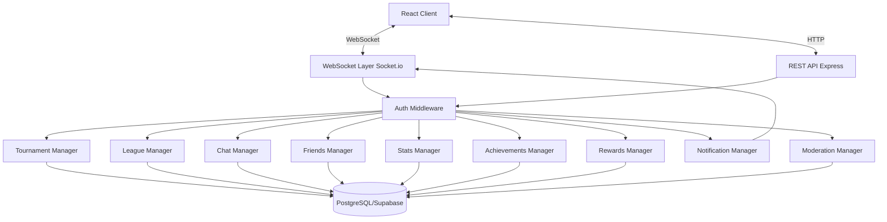

# Documento de Diseño: Funcionalidades Sociales y Competitivas

## Overview

Este diseño extiende el sistema existente de Casino 21 con funcionalidades sociales y competitivas. El sistema base ya implementa autenticación JWT/Supabase, matchmaking mediante salas WebSocket, motor de juego con validación server-side, y sistema básico de ranking Elo.

Las nuevas funcionalidades incluyen:

1. **Sistema de Torneos**: Competiciones estructuradas con brackets de eliminación simple
2. **Sistema de Ligas por Temporadas**: Clasificación por divisiones basadas en Elo con resets periódicos
3. **Chat en Tiempo Real**: Comunicación entre jugadores durante partidas con moderación
4. **Sistema de Amistades**: Gestión de relaciones sociales e invitaciones a partidas privadas
5. **Estadísticas Avanzadas**: Métricas detalladas de desempeño y evolución histórica
6. **Sistema de Logros**: Objetivos desbloqueables con criterios específicos
7. **Sistema de Recompensas**: XP, niveles y títulos especiales
8. **Notificaciones en Tiempo Real**: Alertas de eventos importantes vía WebSocket
9. **Moderación y Seguridad**: Reportes, bloqueos y rate limiting

El diseño mantiene la arquitectura existente (Node.js + Express + Socket.io + PostgreSQL/Supabase) y extiende el esquema de base de datos y los eventos WebSocket.

## Architecture

### High-Level Architecture



### Technology Stack

- **Backend**: Node.js + TypeScript + Express
- **Real-time**: Socket.io (WebSocket)
- **Database**: PostgreSQL via Supabase
- **Authentication**: JWT (Supabase Auth)
- **ORM**: Supabase Client (REST API wrapper)

### Design Principles

1. **Server Authority**: All game logic and data validation occurs server-side
2. **Real-time First**: Use WebSocket events for immediate feedback
3. **Eventual Consistency**: Background jobs handle non-critical updates
4. **Fail-Safe**: Graceful degradation when services are unavailable
5. **Rate Limiting**: Protect against abuse and spam
6. **Audit Trail**: Log all critical actions for moderation

## Components and Interfaces

### 1. Tournament Manager

Manages tournament lifecycle from creation to completion.

**Responsibilities**:
- Create tournaments with configurable player limits
- Generate unique tournament codes
- Handle player registration
- Generate elimination brackets
- Track match results and advance winners
- Handle player no-shows and disqualifications
- Distribute rewards

**Key Methods**:

```typescript
interface TournamentManager {
  createTournament(creatorId: string, config: TournamentConfig): Promise<Tournament>;
  joinTournament(tournamentCode: string, playerId: string): Promise<void>;
  startTournament(tournamentId: string): Promise<void>;
  recordMatchResult(tournamentId: string, matchId: string, winnerId: string): Promise<void>;
  advanceWinner(tournamentId: string, matchId: string): Promise<void>;
  handleNoShow(tournamentId: string, playerId: string): Promise<void>;
  getTournamentBracket(tournamentId: string): Promise<TournamentBracket>;
  completeTournament(tournamentId: string): Promise<void>;
}

interface TournamentConfig {
  maxPlayers: 4 | 8 | 16 | 32;
  name?: string;
}

interface Tournament {
  id: string;
  code: string;
  creatorId: string;
  maxPlayers: number;
  currentPlayers: number;
  status: 'waiting' | 'in_progress' | 'completed';
  bracket: TournamentBracket;
  createdAt: Date;
  startedAt?: Date;
  completedAt?: Date;
}

interface TournamentBracket {
  rounds: Round[];
}

interface Round {
  roundNumber: number;
  matches: TournamentMatch[];
}

interface TournamentMatch {
  id: string;
  player1Id: string;
  player2Id: string;
  winnerId?: string;
  status: 'pending' | 'in_progress' | 'completed' | 'no_show';
  roomId?: string;
}
```

### 2. League Manager

Manages seasonal leagues with division-based rankings.

**Responsibilities**:
- Calculate player divisions based on Elo
- Track seasonal rankings
- Handle season transitions and Elo soft resets
- Distribute end-of-season rewards
- Maintain historical season data

**Key Methods**:

```typescript
interface LeagueManager {
  getCurrentSeason(): Promise<Season>;
  getPlayerDivision(playerId: string): Promise<Division>;
  getDivisionLeaderboard(division: Division, limit: number): Promise<LeaderboardEntry[]>;
  endSeason(): Promise<void>;
  startNewSeason(): Promise<void>;
  applySeasonalEloReset(): Promise<void>;
  getPlayerSeasonHistory(playerId: string): Promise<SeasonHistory[]>;
}

interface Season {
  id: string;
  number: number;
  startDate: Date;
  endDate: Date;
  status: 'active' | 'completed';
}

type Division = 'bronze' | 'silver' | 'gold' | 'platinum' | 'diamond';

interface LeaderboardEntry {
  playerId: string;
  username: string;
  elo: number;
  wins: number;
  losses: number;
  rank: number;
}

interface SeasonHistory {
  seasonNumber: number;
  division: Division;
  finalRank: number;
  finalElo: number;
  wins: number;
  losses: number;
}
```

### 3. Chat Manager

Handles real-time messaging with moderation.

**Responsibilities**:
- Validate and relay chat messages
- Apply rate limiting per player
- Filter offensive content
- Store message history
- Handle message reports

**Key Methods**:

```typescript
interface ChatManager {
  sendMessage(roomId: string, playerId: string, content: string): Promise<ChatMessage>;
  getMessageHistory(roomId: string, limit: number): Promise<ChatMessage[]>;
  reportMessage(messageId: string, reporterId: string, reason: string): Promise<void>;
  filterContent(content: string): string;
  checkRateLimit(playerId: string): boolean;
  mutePlayer(roomId: string, playerId: string): void;
}

interface ChatMessage {
  id: string;
  roomId: string;
  playerId: string;
  username: string;
  content: string;
  timestamp: Date;
  reported: boolean;
}
```

### 4. Friends Manager

Manages social relationships and invitations.

**Responsibilities**:
- Handle friend requests
- Maintain friendship relationships
- Track online status
- Send and manage game invitations
- Create private game rooms

**Key Methods**:

```typescript
interface FriendsManager {
  searchPlayers(query: string): Promise<PlayerSearchResult[]>;
  sendFriendRequest(fromId: string, toId: string): Promise<void>;
  acceptFriendRequest(requestId: string): Promise<void>;
  rejectFriendRequest(requestId: string): Promise<void>;
  removeFriend(playerId: string, friendId: string): Promise<void>;
  getFriendsList(playerId: string): Promise<Friend[]>;
  getPendingRequests(playerId: string): Promise<FriendRequest[]>;
  sendGameInvitation(fromId: string, toId: string): Promise<GameInvitation>;
  acceptGameInvitation(invitationId: string): Promise<string>; // returns roomId
  rejectGameInvitation(invitationId: string): Promise<void>;
}

interface Friend {
  id: string;
  username: string;
  status: 'online' | 'offline' | 'in_game';
  elo: number;
}

interface FriendRequest {
  id: string;
  fromId: string;
  fromUsername: string;
  toId: string;
  status: 'pending' | 'accepted' | 'rejected';
  createdAt: Date;
}

interface GameInvitation {
  id: string;
  fromId: string;
  fromUsername: string;
  toId: string;
  status: 'pending' | 'accepted' | 'rejected' | 'expired';
  createdAt: Date;
  expiresAt: Date;
}
```

### 5. Stats Manager

Tracks and calculates player statistics.

**Responsibilities**:
- Record match outcomes and performance metrics
- Calculate win rates and streaks
- Track Elo history
- Generate performance analytics
- Compare stats between players

**Key Methods**:

```typescript
interface StatsManager {
  recordMatchStats(matchId: string, stats: MatchStats): Promise<void>;
  getPlayerStats(playerId: string): Promise<PlayerStats>;
  getEloHistory(playerId: string, days: number): Promise<EloHistoryPoint[]>;
  getRecentMatches(playerId: string, limit: number): Promise<MatchSummary[]>;
  getStatsByDivision(playerId: string): Promise<DivisionStats[]>;
  compareStats(playerId1: string, playerId2: string): Promise<StatsComparison>;
}

interface MatchStats {
  playerId: string;
  cardsPlayed: number;
  averageTurnTime: number;
  boardPositions: Record<string, number>;
}

interface PlayerStats {
  totalMatches: number;
  wins: number;
  losses: number;
  winRate: number;
  currentStreak: number;
  bestStreak: number;
  currentElo: number;
  peakElo: number;
  averageTurnTime: number;
}

interface EloHistoryPoint {
  date: Date;
  elo: number;
}

interface MatchSummary {
  id: string;
  date: Date;
  opponentId: string;
  opponentUsername: string;
  result: 'win' | 'loss';
  eloChange: number;
}

interface DivisionStats {
  division: Division;
  wins: number;
  losses: number;
  winRate: number;
}
```

### 6. Achievements Manager

Tracks and awards achievements.

**Responsibilities**:
- Define achievement criteria
- Monitor player progress
- Award achievements when criteria met
- Calculate achievement rarity
- Notify players of unlocks

**Key Methods**:

```typescript
interface AchievementsManager {
  checkAchievements(playerId: string, context: GameContext): Promise<Achievement[]>;
  getPlayerAchievements(playerId: string): Promise<PlayerAchievement[]>;
  getAllAchievements(): Promise<Achievement[]>;
  getAchievementProgress(playerId: string, achievementId: string): Promise<number>;
  awardAchievement(playerId: string, achievementId: string): Promise<void>;
}

interface Achievement {
  id: string;
  name: string;
  description: string;
  category: 'beginner' | 'intermediate' | 'advanced' | 'master';
  criteria: AchievementCriteria;
  xpReward: number;
  rarityPercentage: number;
}

interface AchievementCriteria {
  type: 'wins' | 'streak' | 'elo' | 'matches' | 'tournament' | 'custom';
  target: number;
  condition?: string;
}

interface PlayerAchievement {
  achievementId: string;
  unlockedAt: Date;
  progress: number;
}

interface GameContext {
  matchResult?: 'win' | 'loss';
  currentStreak?: number;
  currentElo?: number;
  tournamentPosition?: number;
}
```

### 7. Rewards Manager

Manages XP, levels, and titles.

**Responsibilities**:
- Award XP for various actions
- Calculate player levels
- Grant titles
- Handle level-up notifications

**Key Methods**:

```typescript
interface RewardsManager {
  awardXP(playerId: string, amount: number, reason: string): Promise<void>;
  calculateLevel(xp: number): number;
  getPlayerLevel(playerId: string): Promise<PlayerLevel>;
  awardTitle(playerId: string, titleId: string): Promise<void>;
  setActiveTitle(playerId: string, titleId: string): Promise<void>;
  getAvailableTitles(playerId: string): Promise<Title[]>;
}

interface PlayerLevel {
  level: number;
  currentXP: number;
  xpForNextLevel: number;
  progressPercentage: number;
}

interface Title {
  id: string;
  name: string;
  description: string;
  requirement: string;
  unlocked: boolean;
}
```

### 8. Notification Manager

Delivers real-time notifications to players.

**Responsibilities**:
- Queue and deliver notifications
- Track read/unread status
- Handle notification preferences
- Emit WebSocket events

**Key Methods**:

```typescript
interface NotificationManager {
  sendNotification(playerId: string, notification: Notification): Promise<void>;
  getNotifications(playerId: string, limit: number): Promise<Notification[]>;
  markAsRead(notificationId: string): Promise<void>;
  markAllAsRead(playerId: string): Promise<void>;
  getUnreadCount(playerId: string): Promise<number>;
}

interface Notification {
  id: string;
  playerId: string;
  type: 'friend_request' | 'game_invitation' | 'friend_online' | 'tournament_starting' | 'tournament_ready' | 'achievement' | 'level_up';
  title: string;
  message: string;
  data?: any;
  read: boolean;
  createdAt: Date;
}
```

### 9. Moderation Manager

Handles reports, blocks, and security.

**Responsibilities**:
- Process player reports
- Apply temporary bans
- Manage block lists
- Enforce rate limits
- Log suspicious activity

**Key Methods**:

```typescript
interface ModerationManager {
  reportPlayer(reporterId: string, reportedId: string, reason: string, evidence?: string): Promise<void>;
  blockPlayer(playerId: string, blockedId: string): Promise<void>;
  unblockPlayer(playerId: string, blockedId: string): Promise<void>;
  getBlockedPlayers(playerId: string): Promise<string[]>;
  applyTemporaryBan(playerId: string, duration: number, reason: string): Promise<void>;
  checkRateLimit(playerId: string, action: string): boolean;
  logSuspiciousActivity(playerId: string, activity: string, details: any): Promise<void>;
}
```

## Data Models

### Database Schema Extensions

The existing schema includes `profiles` and `matches` tables. We extend it with:

```sql
-- Tournaments
CREATE TABLE tournaments (
  id UUID PRIMARY KEY DEFAULT uuid_generate_v4(),
  code VARCHAR(6) UNIQUE NOT NULL,
  creator_id UUID REFERENCES profiles(id) NOT NULL,
  max_players INTEGER NOT NULL CHECK (max_players IN (4, 8, 16, 32)),
  current_players INTEGER DEFAULT 0,
  status VARCHAR(20) DEFAULT 'waiting' CHECK (status IN ('waiting', 'in_progress', 'completed')),
  bracket JSONB,
  created_at TIMESTAMPTZ DEFAULT NOW(),
  started_at TIMESTAMPTZ,
  completed_at TIMESTAMPTZ
);

CREATE INDEX idx_tournaments_code ON tournaments(code);
CREATE INDEX idx_tournaments_status ON tournaments(status);

-- Tournament Participants
CREATE TABLE tournament_participants (
  id UUID PRIMARY KEY DEFAULT uuid_generate_v4(),
  tournament_id UUID REFERENCES tournaments(id) ON DELETE CASCADE,
  player_id UUID REFERENCES profiles(id),
  position INTEGER,
  eliminated_at TIMESTAMPTZ,
  UNIQUE(tournament_id, player_id)
);

CREATE INDEX idx_tournament_participants_tournament ON tournament_participants(tournament_id);
CREATE INDEX idx_tournament_participants_player ON tournament_participants(player_id);

-- Seasons
CREATE TABLE seasons (
  id UUID PRIMARY KEY DEFAULT uuid_generate_v4(),
  season_number INTEGER UNIQUE NOT NULL,
  start_date TIMESTAMPTZ NOT NULL,
  end_date TIMESTAMPTZ NOT NULL,
  status VARCHAR(20) DEFAULT 'active' CHECK (status IN ('active', 'completed'))
);

-- Season Rankings
CREATE TABLE season_rankings (
  id UUID PRIMARY KEY DEFAULT uuid_generate_v4(),
  season_id UUID REFERENCES seasons(id),
  player_id UUID REFERENCES profiles(id),
  division VARCHAR(20) NOT NULL,
  final_rank INTEGER,
  final_elo INTEGER,
  wins INTEGER DEFAULT 0,
  losses INTEGER DEFAULT 0,
  UNIQUE(season_id, player_id)
);

CREATE INDEX idx_season_rankings_season ON season_rankings(season_id);
CREATE INDEX idx_season_rankings_player ON season_rankings(player_id);
CREATE INDEX idx_season_rankings_division_rank ON season_rankings(season_id, division, final_rank);

-- Chat Messages
CREATE TABLE chat_messages (
  id UUID PRIMARY KEY DEFAULT uuid_generate_v4(),
  room_id VARCHAR(50) NOT NULL,
  player_id UUID REFERENCES profiles(id),
  username VARCHAR(100) NOT NULL,
  content TEXT NOT NULL CHECK (LENGTH(content) BETWEEN 1 AND 200),
  reported BOOLEAN DEFAULT FALSE,
  created_at TIMESTAMPTZ DEFAULT NOW()
);

CREATE INDEX idx_chat_messages_room ON chat_messages(room_id, created_at DESC);
CREATE INDEX idx_chat_messages_reported ON chat_messages(reported) WHERE reported = TRUE;

-- Friendships
CREATE TABLE friendships (
  id UUID PRIMARY KEY DEFAULT uuid_generate_v4(),
  player1_id UUID REFERENCES profiles(id),
  player2_id UUID REFERENCES profiles(id),
  created_at TIMESTAMPTZ DEFAULT NOW(),
  CHECK (player1_id < player2_id),
  UNIQUE(player1_id, player2_id)
);

CREATE INDEX idx_friendships_player1 ON friendships(player1_id);
CREATE INDEX idx_friendships_player2 ON friendships(player2_id);

-- Friend Requests
CREATE TABLE friend_requests (
  id UUID PRIMARY KEY DEFAULT uuid_generate_v4(),
  from_id UUID REFERENCES profiles(id),
  to_id UUID REFERENCES profiles(id),
  status VARCHAR(20) DEFAULT 'pending' CHECK (status IN ('pending', 'accepted', 'rejected')),
  created_at TIMESTAMPTZ DEFAULT NOW(),
  UNIQUE(from_id, to_id)
);

CREATE INDEX idx_friend_requests_to ON friend_requests(to_id, status);

-- Game Invitations
CREATE TABLE game_invitations (
  id UUID PRIMARY KEY DEFAULT uuid_generate_v4(),
  from_id UUID REFERENCES profiles(id),
  to_id UUID REFERENCES profiles(id),
  status VARCHAR(20) DEFAULT 'pending' CHECK (status IN ('pending', 'accepted', 'rejected', 'expired')),
  created_at TIMESTAMPTZ DEFAULT NOW(),
  expires_at TIMESTAMPTZ DEFAULT NOW() + INTERVAL '5 minutes'
);

CREATE INDEX idx_game_invitations_to ON game_invitations(to_id, status);

-- Player Stats (extended)
CREATE TABLE player_stats (
  player_id UUID PRIMARY KEY REFERENCES profiles(id),
  total_matches INTEGER DEFAULT 0,
  wins INTEGER DEFAULT 0,
  losses INTEGER DEFAULT 0,
  current_streak INTEGER DEFAULT 0,
  best_streak INTEGER DEFAULT 0,
  peak_elo INTEGER DEFAULT 1000,
  total_cards_played INTEGER DEFAULT 0,
  average_turn_time_ms INTEGER DEFAULT 0,
  updated_at TIMESTAMPTZ DEFAULT NOW()
);

-- Elo History
CREATE TABLE elo_history (
  id UUID PRIMARY KEY DEFAULT uuid_generate_v4(),
  player_id UUID REFERENCES profiles(id),
  elo INTEGER NOT NULL,
  recorded_at TIMESTAMPTZ DEFAULT NOW()
);

CREATE INDEX idx_elo_history_player_date ON elo_history(player_id, recorded_at DESC);

-- Achievements
CREATE TABLE achievements (
  id UUID PRIMARY KEY DEFAULT uuid_generate_v4(),
  name VARCHAR(100) UNIQUE NOT NULL,
  description TEXT NOT NULL,
  category VARCHAR(20) NOT NULL CHECK (category IN ('beginner', 'intermediate', 'advanced', 'master')),
  criteria JSONB NOT NULL,
  xp_reward INTEGER DEFAULT 0
);

-- Player Achievements
CREATE TABLE player_achievements (
  id UUID PRIMARY KEY DEFAULT uuid_generate_v4(),
  player_id UUID REFERENCES profiles(id),
  achievement_id UUID REFERENCES achievements(id),
  progress INTEGER DEFAULT 0,
  unlocked_at TIMESTAMPTZ,
  UNIQUE(player_id, achievement_id)
);

CREATE INDEX idx_player_achievements_player ON player_achievements(player_id);

-- Titles
CREATE TABLE titles (
  id UUID PRIMARY KEY DEFAULT uuid_generate_v4(),
  name VARCHAR(100) UNIQUE NOT NULL,
  description TEXT NOT NULL,
  requirement TEXT NOT NULL
);

-- Player Titles
CREATE TABLE player_titles (
  id UUID PRIMARY KEY DEFAULT uuid_generate_v4(),
  player_id UUID REFERENCES profiles(id),
  title_id UUID REFERENCES titles(id),
  unlocked_at TIMESTAMPTZ DEFAULT NOW(),
  UNIQUE(player_id, title_id)
);

-- Extend profiles table
ALTER TABLE profiles ADD COLUMN xp INTEGER DEFAULT 0;
ALTER TABLE profiles ADD COLUMN level INTEGER DEFAULT 1;
ALTER TABLE profiles ADD COLUMN active_title_id UUID REFERENCES titles(id);

-- Notifications
CREATE TABLE notifications (
  id UUID PRIMARY KEY DEFAULT uuid_generate_v4(),
  player_id UUID REFERENCES profiles(id),
  type VARCHAR(50) NOT NULL,
  title VARCHAR(200) NOT NULL,
  message TEXT NOT NULL,
  data JSONB,
  read BOOLEAN DEFAULT FALSE,
  created_at TIMESTAMPTZ DEFAULT NOW()
);

CREATE INDEX idx_notifications_player_read ON notifications(player_id, read, created_at DESC);

-- Reports
CREATE TABLE player_reports (
  id UUID PRIMARY KEY DEFAULT uuid_generate_v4(),
  reporter_id UUID REFERENCES profiles(id),
  reported_id UUID REFERENCES profiles(id),
  reason TEXT NOT NULL,
  evidence TEXT,
  status VARCHAR(20) DEFAULT 'pending' CHECK (status IN ('pending', 'reviewed', 'actioned')),
  created_at TIMESTAMPTZ DEFAULT NOW()
);

CREATE INDEX idx_player_reports_reported ON player_reports(reported_id, created_at DESC);

-- Blocks
CREATE TABLE player_blocks (
  id UUID PRIMARY KEY DEFAULT uuid_generate_v4(),
  player_id UUID REFERENCES profiles(id),
  blocked_id UUID REFERENCES profiles(id),
  created_at TIMESTAMPTZ DEFAULT NOW(),
  UNIQUE(player_id, blocked_id)
);

CREATE INDEX idx_player_blocks_player ON player_blocks(player_id);

-- Temporary Bans
CREATE TABLE temporary_bans (
  id UUID PRIMARY KEY DEFAULT uuid_generate_v4(),
  player_id UUID REFERENCES profiles(id),
  reason TEXT NOT NULL,
  banned_at TIMESTAMPTZ DEFAULT NOW(),
  expires_at TIMESTAMPTZ NOT NULL
);

CREATE INDEX idx_temporary_bans_player_expires ON temporary_bans(player_id, expires_at);

-- Rate Limit Tracking (in-memory or Redis preferred, but can use DB)
CREATE TABLE rate_limits (
  id UUID PRIMARY KEY DEFAULT uuid_generate_v4(),
  player_id UUID REFERENCES profiles(id),
  action VARCHAR(50) NOT NULL,
  count INTEGER DEFAULT 1,
  window_start TIMESTAMPTZ DEFAULT NOW(),
  UNIQUE(player_id, action)
);
```

### WebSocket Events

New events to be added to the existing Socket.io implementation:

```typescript
// Tournament Events
socket.on('create_tournament', (config: TournamentConfig) => void);
socket.on('join_tournament', (code: string) => void);
socket.emit('tournament_created', (tournament: Tournament) => void);
socket.emit('tournament_joined', (tournament: Tournament) => void);
socket.emit('tournament_started', (bracket: TournamentBracket) => void);
socket.emit('tournament_match_ready', (match: TournamentMatch) => void);
socket.emit('tournament_completed', (results: TournamentResults) => void);

// Chat Events
socket.on('send_message', (content: string) => void);
socket.emit('new_message', (message: ChatMessage) => void);
socket.emit('chat_rate_limited', (waitTime: number) => void);

// Friends Events
socket.on('send_friend_request', (targetUsername: string) => void);
socket.on('accept_friend_request', (requestId: string) => void);
socket.on('reject_friend_request', (requestId: string) => void);
socket.on('send_game_invitation', (friendId: string) => void);
socket.on('accept_game_invitation', (invitationId: string) => void);
socket.emit('friend_request_received', (request: FriendRequest) => void);
socket.emit('friend_request_accepted', (friend: Friend) => void);
socket.emit('game_invitation_received', (invitation: GameInvitation) => void);
socket.emit('friend_online', (friend: Friend) => void);
socket.emit('friend_offline', (friendId: string) => void);

// Notification Events
socket.emit('notification', (notification: Notification) => void);

// Achievement Events
socket.emit('achievement_unlocked', (achievement: Achievement) => void);

// Level Events
socket.emit('level_up', (newLevel: number) => void);
```


## Correctness Properties

*A property is a characteristic or behavior that should hold true across all valid executions of a system—essentially, a formal statement about what the system should do. Properties serve as the bridge between human-readable specifications and machine-verifiable correctness guarantees.*

### Property 1: Tournament Configuration Validation

*For any* tournament creation request, the system should accept only player counts of 4, 8, 16, or 32, and reject all other values.

**Validates: Requirements 1.1**

### Property 2: Tournament Code Uniqueness and Format

*For any* created tournament, the generated code should be exactly 6 alphanumeric characters and should be unique across all active tournaments.

**Validates: Requirements 1.2**

### Property 3: Tournament Auto-Start

*For any* tournament, when the number of joined players equals the configured max_players, the tournament status should automatically transition to 'in_progress'.

**Validates: Requirements 1.4**

### Property 4: Bracket Structure Validity

*For any* tournament with N players (where N is a power of 2), the generated bracket should have exactly log2(N) rounds, and round R should have exactly N / 2^R matches.

**Validates: Requirements 1.5**

### Property 5: Winner Advancement

*For any* completed tournament match, the winner should appear as a participant in the corresponding match of the next round (or as tournament winner if final round).

**Validates: Requirements 1.6**

### Property 6: No-Show Disqualification

*For any* tournament match where a player does not join within 5 minutes of match start, that player should be marked as disqualified and their opponent should advance.

**Validates: Requirements 1.8**

### Property 7: Division Calculation Correctness

*For any* player Elo value, the calculated division should match: Bronze (0-1199), Silver (1200-1499), Gold (1500-1799), Platinum (1800-2099), Diamond (2100+).

**Validates: Requirements 2.1**

### Property 8: Season Duration

*For any* created season, the end_date should be exactly 30 days after the start_date.

**Validates: Requirements 2.2**

### Property 9: Seasonal Elo Soft Reset

*For any* player with Elo E at season end, the new season Elo should equal E + 0.2 * (1500 - E).

**Validates: Requirements 2.5**

### Property 10: Chat Message Length Validation

*For any* chat message submission, messages with length outside the range [1, 200] characters should be rejected, and messages within the range should be accepted.

**Validates: Requirements 3.2**

### Property 11: Chat Message Persistence

*For any* successfully sent chat message, querying the database should return the message with correct timestamp, author, and content.

**Validates: Requirements 3.4**

### Property 12: Message Report Marking

*For any* chat message that is reported, the message's reported flag should be set to true in the database.

**Validates: Requirements 3.7**

### Property 13: Chat Rate Limiting

*For any* player who sends more than 10 messages within a 30-second window, subsequent message attempts should be rejected until the rate limit cooldown expires.

**Validates: Requirements 3.9**

### Property 14: Offensive Content Filtering

*For any* chat message containing words from the offensive words list, those words should be replaced with asterisks in the stored and transmitted message.

**Validates: Requirements 3.10**

### Property 15: Player Search Results

*For any* search query, all returned players should have usernames that contain the query string (case-insensitive).

**Validates: Requirements 4.1**

### Property 16: Friend Request to Friendship Flow

*For any* accepted friend request between players A and B, a bidirectional friendship record should exist in the database allowing both players to see each other in their friends list.

**Validates: Requirements 4.2, 4.4, 4.5**

### Property 17: Friend Limit Enforcement

*For any* player, the system should prevent adding a new friend if the player already has 100 friends.

**Validates: Requirements 4.12**

### Property 18: Game Invitation to Private Room

*For any* accepted game invitation between friends, a private room should be created with both players as participants.

**Validates: Requirements 4.10**

### Property 19: Win Rate Calculation

*For any* player with W wins and T total matches, the calculated win rate should equal W / T (or 0 if T = 0).

**Validates: Requirements 5.2**

### Property 20: Achievement Unlock and XP Award

*For any* player who meets an achievement's criteria, the achievement should be marked as unlocked and the player's XP should increase by the achievement's xp_reward value.

**Validates: Requirements 6.3, 6.9**

### Property 21: Achievement Rarity Calculation

*For any* achievement, the rarity percentage should equal (number of players with achievement / total number of players) * 100.

**Validates: Requirements 6.7**

### Property 22: Match Completion XP Award

*For any* completed match, the winner should receive 50 XP and the loser should receive 20 XP.

**Validates: Requirements 7.1**

### Property 23: Level Calculation Formula

*For any* player with XP amount X, the calculated level should equal floor(sqrt(X / 100)).

**Validates: Requirements 7.2**

### Property 24: Tournament Position Rewards

*For any* completed tournament, participants should receive XP based on their final position: 1st place = 500 XP, 2nd place = 300 XP, 3rd place = 150 XP.

**Validates: Requirements 1.10, 7.4**

### Property 25: League Season Rewards

*For any* completed season, players should receive XP based on their final rank: top 10 = 1000 XP, top 11-50 = 500 XP, top 51-100 = 200 XP.

**Validates: Requirements 2.4, 7.5**

### Property 26: Active Title Restriction

*For any* player attempting to set an active title, the operation should succeed only if the player has unlocked that title.

**Validates: Requirements 7.9**

### Property 27: Notification Creation on Events

*For any* significant event (friend request, game invitation, achievement unlock, level up, tournament round ready), a corresponding notification should be created for the affected player(s).

**Validates: Requirements 4.3, 4.7, 4.9, 6.4, 7.3, 8.1, 8.2, 8.3, 8.5, 8.6, 8.7**

### Property 28: Notification History Retention

*For any* player's notification query, only notifications created within the last 24 hours should be returned.

**Validates: Requirements 8.8**

### Property 29: Unread Notification Count

*For any* player, the unread notification count should equal the number of notifications with read=false.

**Validates: Requirements 8.10**

### Property 30: Data Persistence Round-Trip

*For any* created entity (tournament, friendship, chat message, stat, achievement, season history), querying the database immediately after creation should return the entity with all its properties intact.

**Validates: Requirements 9.1, 9.2, 9.3, 9.4, 9.5, 9.6**

### Property 31: Automatic Ban on Report Threshold

*For any* player who receives 5 or more reports within a 24-hour period, a temporary ban should be automatically applied.

**Validates: Requirements 10.3**

### Property 32: Player Report Persistence

*For any* submitted player report, the report should be stored in the database with reporter_id, reported_id, reason, evidence, and timestamp.

**Validates: Requirements 10.2**

### Property 33: Input Validation Against Injection

*For any* user input containing SQL injection patterns (e.g., "'; DROP TABLE", "<script>"), the input should be rejected or sanitized before processing.

**Validates: Requirements 10.6**

### Property 34: Global Rate Limiting

*For any* player who performs more than 100 actions within a 60-second window, subsequent actions should be rejected until the rate limit window resets.

**Validates: Requirements 10.7, 10.8**

### Property 35: Audit Logging of Suspicious Activity

*For any* detected suspicious activity (e.g., rapid repeated actions, invalid state transitions), an entry should be created in the audit log with player_id, activity type, and details.

**Validates: Requirements 10.10**


## Error Handling

### Error Categories

1. **Validation Errors**: Invalid input data (e.g., invalid tournament size, message too long)
   - HTTP Status: 400 Bad Request
   - WebSocket: Emit error event with validation details
   - User Action: Display error message, allow retry

2. **Authentication Errors**: Invalid or expired JWT token
   - HTTP Status: 401 Unauthorized
   - WebSocket: Disconnect with authentication error
   - User Action: Redirect to login

3. **Authorization Errors**: User lacks permission (e.g., trying to start someone else's tournament)
   - HTTP Status: 403 Forbidden
   - WebSocket: Emit error event
   - User Action: Display error message

4. **Not Found Errors**: Resource doesn't exist (e.g., invalid tournament code)
   - HTTP Status: 404 Not Found
   - WebSocket: Emit error event
   - User Action: Display error message, suggest alternatives

5. **Conflict Errors**: State conflict (e.g., already friends, tournament already full)
   - HTTP Status: 409 Conflict
   - WebSocket: Emit error event with current state
   - User Action: Refresh state, display message

6. **Rate Limit Errors**: Too many requests
   - HTTP Status: 429 Too Many Requests
   - WebSocket: Emit rate_limited event with retry time
   - User Action: Display cooldown timer

7. **Database Errors**: Connection failures, query errors
   - HTTP Status: 500 Internal Server Error
   - WebSocket: Emit error event (generic message)
   - User Action: Display "try again later" message
   - Server Action: Log error, alert monitoring

8. **Timeout Errors**: Operation took too long
   - HTTP Status: 504 Gateway Timeout
   - WebSocket: Emit timeout event
   - User Action: Retry operation

### Error Response Format

```typescript
interface ErrorResponse {
  error: {
    code: string;
    message: string;
    details?: any;
    retryAfter?: number; // seconds
  };
}
```

### Graceful Degradation

- **Chat Unavailable**: Display message, allow gameplay to continue
- **Stats Service Down**: Cache stats locally, sync when available
- **Notification Service Down**: Queue notifications, deliver when restored
- **Database Connection Lost**: Use in-memory state, persist when reconnected

### Recovery Strategies

1. **Automatic Retry**: For transient failures (network, timeout)
   - Exponential backoff: 1s, 2s, 4s, 8s
   - Max 3 retries

2. **Manual Retry**: For user-initiated actions
   - Display retry button
   - Clear error message

3. **Fallback**: For non-critical features
   - Disable feature temporarily
   - Show degraded experience message

4. **Circuit Breaker**: For external dependencies
   - Open circuit after 5 consecutive failures
   - Half-open after 30 seconds
   - Close after 2 successful requests

## Testing Strategy

### Dual Testing Approach

This feature requires both unit tests and property-based tests for comprehensive coverage:

- **Unit Tests**: Verify specific examples, edge cases, and error conditions
- **Property Tests**: Verify universal properties across all inputs

Together, these approaches provide comprehensive coverage where unit tests catch concrete bugs and property tests verify general correctness.

### Property-Based Testing

**Library**: fast-check (JavaScript/TypeScript property-based testing library)

**Configuration**:
- Minimum 100 iterations per property test
- Each test must reference its design document property
- Tag format: `Feature: social-competitive-features, Property {number}: {property_text}`

**Property Test Examples**:

```typescript
import fc from 'fast-check';

// Feature: social-competitive-features, Property 1: Tournament Configuration Validation
describe('Tournament Configuration Validation', () => {
  it('should accept only valid player counts', () => {
    fc.assert(
      fc.property(
        fc.integer({ min: 1, max: 100 }),
        (playerCount) => {
          const validCounts = [4, 8, 16, 32];
          const result = validateTournamentConfig({ maxPlayers: playerCount });
          
          if (validCounts.includes(playerCount)) {
            expect(result.valid).toBe(true);
          } else {
            expect(result.valid).toBe(false);
          }
        }
      ),
      { numRuns: 100 }
    );
  });
});

// Feature: social-competitive-features, Property 7: Division Calculation Correctness
describe('Division Calculation', () => {
  it('should correctly map Elo to divisions', () => {
    fc.assert(
      fc.property(
        fc.integer({ min: 0, max: 3000 }),
        (elo) => {
          const division = calculateDivision(elo);
          
          if (elo < 1200) expect(division).toBe('bronze');
          else if (elo < 1500) expect(division).toBe('silver');
          else if (elo < 1800) expect(division).toBe('gold');
          else if (elo < 2100) expect(division).toBe('platinum');
          else expect(division).toBe('diamond');
        }
      ),
      { numRuns: 100 }
    );
  });
});

// Feature: social-competitive-features, Property 9: Seasonal Elo Soft Reset
describe('Seasonal Elo Reset', () => {
  it('should apply 20% soft reset toward 1500', () => {
    fc.assert(
      fc.property(
        fc.integer({ min: 0, max: 3000 }),
        (oldElo) => {
          const newElo = applySeasonalReset(oldElo);
          const expected = Math.round(oldElo + 0.2 * (1500 - oldElo));
          
          expect(newElo).toBe(expected);
        }
      ),
      { numRuns: 100 }
    );
  });
});

// Feature: social-competitive-features, Property 14: Offensive Content Filtering
describe('Content Filtering', () => {
  it('should replace offensive words with asterisks', () => {
    const offensiveWords = ['badword1', 'badword2', 'badword3'];
    
    fc.assert(
      fc.property(
        fc.array(fc.oneof(
          fc.constantFrom(...offensiveWords),
          fc.string({ minLength: 1, maxLength: 20 })
        )),
        (words) => {
          const message = words.join(' ');
          const filtered = filterContent(message);
          
          offensiveWords.forEach(word => {
            expect(filtered).not.toContain(word);
            if (message.includes(word)) {
              expect(filtered).toContain('*'.repeat(word.length));
            }
          });
        }
      ),
      { numRuns: 100 }
    );
  });
});

// Feature: social-competitive-features, Property 23: Level Calculation Formula
describe('Level Calculation', () => {
  it('should calculate level as floor(sqrt(XP / 100))', () => {
    fc.assert(
      fc.property(
        fc.integer({ min: 0, max: 1000000 }),
        (xp) => {
          const level = calculateLevel(xp);
          const expected = Math.floor(Math.sqrt(xp / 100));
          
          expect(level).toBe(expected);
        }
      ),
      { numRuns: 100 }
    );
  });
});
```

### Unit Testing

**Focus Areas**:
- Specific edge cases (empty inputs, boundary values)
- Error conditions (invalid tokens, missing data)
- Integration points (WebSocket events, database transactions)
- Business logic examples (specific tournament scenarios)

**Unit Test Examples**:

```typescript
describe('TournamentManager', () => {
  it('should reject tournament creation with 0 players', async () => {
    await expect(
      tournamentManager.createTournament(userId, { maxPlayers: 0 })
    ).rejects.toThrow('Invalid player count');
  });

  it('should generate unique tournament codes', async () => {
    const codes = new Set();
    for (let i = 0; i < 100; i++) {
      const tournament = await tournamentManager.createTournament(userId, { maxPlayers: 8 });
      expect(codes.has(tournament.code)).toBe(false);
      codes.add(tournament.code);
    }
  });

  it('should handle tournament with exactly 8 players', async () => {
    const tournament = await tournamentManager.createTournament(userId, { maxPlayers: 8 });
    
    for (let i = 0; i < 7; i++) {
      await tournamentManager.joinTournament(tournament.code, `player${i}`);
    }
    
    const updated = await tournamentManager.getTournament(tournament.id);
    expect(updated.status).toBe('in_progress');
  });
});

describe('ChatManager', () => {
  it('should reject empty messages', async () => {
    await expect(
      chatManager.sendMessage(roomId, playerId, '')
    ).rejects.toThrow('Message too short');
  });

  it('should reject messages over 200 characters', async () => {
    const longMessage = 'a'.repeat(201);
    await expect(
      chatManager.sendMessage(roomId, playerId, longMessage)
    ).rejects.toThrow('Message too long');
  });

  it('should apply rate limit after 10 messages', async () => {
    for (let i = 0; i < 10; i++) {
      await chatManager.sendMessage(roomId, playerId, `message ${i}`);
    }
    
    await expect(
      chatManager.sendMessage(roomId, playerId, 'message 11')
    ).rejects.toThrow('Rate limited');
  });
});

describe('FriendsManager', () => {
  it('should prevent duplicate friend requests', async () => {
    await friendsManager.sendFriendRequest(player1, player2);
    
    await expect(
      friendsManager.sendFriendRequest(player1, player2)
    ).rejects.toThrow('Request already exists');
  });

  it('should create bidirectional friendship on accept', async () => {
    const request = await friendsManager.sendFriendRequest(player1, player2);
    await friendsManager.acceptFriendRequest(request.id);
    
    const player1Friends = await friendsManager.getFriendsList(player1);
    const player2Friends = await friendsManager.getFriendsList(player2);
    
    expect(player1Friends.some(f => f.id === player2)).toBe(true);
    expect(player2Friends.some(f => f.id === player1)).toBe(true);
  });
});
```

### Integration Testing

**Scenarios**:
1. Complete tournament flow (create → join → play → complete)
2. Friend request to private game flow
3. Achievement unlock triggering notification and XP award
4. Season end triggering Elo reset and reward distribution
5. Chat message with offensive content being filtered and reported

**Tools**:
- Supertest for HTTP API testing
- Socket.io-client for WebSocket testing
- Test database with migrations

### Performance Testing

**Metrics**:
- WebSocket message latency < 100ms (p95)
- Database query time < 50ms (p95)
- Tournament bracket generation < 500ms
- Concurrent users: 1000+ simultaneous connections

**Tools**:
- Artillery for load testing
- k6 for WebSocket stress testing

### Security Testing

**Focus**:
- SQL injection attempts in all text inputs
- JWT token manipulation
- Rate limit bypass attempts
- Cross-player data access attempts
- WebSocket authentication bypass

**Tools**:
- OWASP ZAP for vulnerability scanning
- Custom scripts for injection testing

