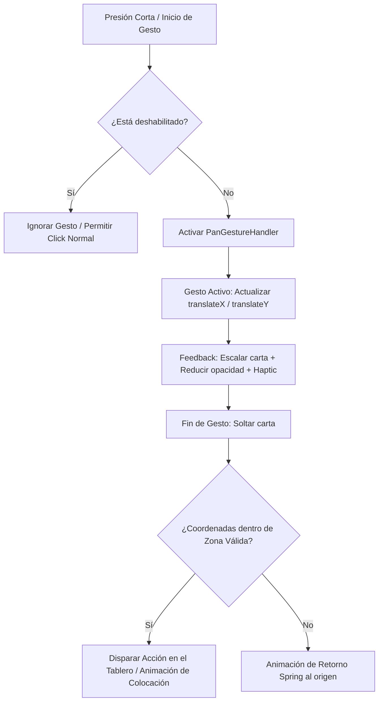

# Especificación Técnica: Tarjeta Arrastrable en Android ([DraggableCard.tsx](file:///c:/Users/angel/Desktop/Develop/Web%20all%20projects/casino-21-card-game/src/web/components/DraggableCard.tsx))

Esta especificación detalla la migración y adaptación del componente web [DraggableCard.tsx](file:///c:/Users/angel/Desktop/Develop/Web%20all%20projects/casino-21-card-game/src/web/components/DraggableCard.tsx) (que utiliza `@dnd-kit/core` y `@dnd-kit/utilities`) al entorno nativo de **Android** usando **React Native (Expo)**. Se define el uso de `react-native-gesture-handler` (específicamente `PanGestureHandler` según las reglas del proyecto) y `react-native-reanimated` para lograr un rendimiento óptimo de 60 FPS ejecutándose en el hilo de UI.

---

## 1. Comparativa de Arquitectura (Web vs. Android)

El comportamiento de arrastre en la web depende del DOM y de listeners de eventos administrados por `@dnd-kit`. En Android, el motor de gestos y animaciones debe interactuar directamente con el hilo nativo de UI para evitar retrasos por el puente JavaScript.

| Característica / Librería | Implementación Web (Vite + React) | Implementación Android (RN + Expo) |
| :--- | :--- | :--- |
| **Manejador de Gestos** | `@dnd-kit/core` (`useDraggable`) | `react-native-gesture-handler` (`PanGestureHandler`) |
| **Gestión de Animaciones** | Estilos en línea (`transform`, `opacity`) | `react-native-reanimated` (`useAnimatedStyle`) |
| **Detección de Dropping** | `@dnd-kit` Contexto / `useDroppable` | Bounding Boxes del Tablero + Medición de Coordenadas Relativas |
| **Feedback de Interacción** | CSS (`transition`, `:hover`) | Animación de escala activa (`useSharedValue` + `withSpring`) |
| **Feedback Háptico** | No soportado de forma estándar | `expo-haptics` (Vibraciones cortas al iniciar arrastre / sobrevolar zonas) |
| **Sonido de Arrastre** | Audio API de Web | `expo-av` (Sonido pre-cargado de carta) |

---

## 2. Flujo de Control de Gestos en Android

El ciclo de vida del gesto de arrastrar una carta sigue tres fases definidas en el hilo nativo:



### 2.1 Variables Compartidas (Reanimated Shared Values)
Para que las animaciones ocurran a 60 FPS en el hilo de UI, se declaran variables que controlan la posición y escala de la carta sin gatillar re-renders de React:
* `translateX`: Desplazamiento horizontal relativo.
* `translateY`: Desplazamiento vertical relativo.
* `scale`: Aumenta ligeramente el tamaño de la carta al arrastrar (e.g., de `1.0` a `1.08`) para dar sensación de "elevación".
* `opacity`: Reduce la opacidad (e.g., `0.7`) mientras se arrastra, permitiendo ver qué hay debajo (paridad con la web).
* `zIndex`: Cambia el orden de renderizado para colocar la carta por encima de todas las demás.

---

## 3. Especificación del Componente `DraggableCard.tsx` en Android

### 3.1 Mapeo de Props
Las propiedades del componente nativo deben ser exactamente idénticas a las del componente web para garantizar la paridad e integración con la lógica de negocio del frontend:

```typescript
import { Card } from '../../domain/card'; // Ver [card.ts](file:///c:/Users/angel/Desktop/Develop/Web%20all%20projects/casino-21-card-game/src/domain/card.ts)
import { CardTheme } from '../themes/themeRegistry';

interface DraggableCardProps {
  card: Card;
  disabled?: boolean;
  selected?: boolean;
  onClick?: () => void;
  theme?: CardTheme;
  // Propiedad adicional opcional para comunicar colisiones al contenedor padre
  onDragEnd?: (card: Card, absoluteX: number, absoluteY: number) => void;
}
```

### 3.2 Código de Referencia para Android (React Native)

A continuación, se detalla la especificación del componente utilizando `PanGestureHandler` y `Animated` desde Reanimated, envuelto de manera óptima para no perder la lógica original.

```tsx
import React, { useRef } from 'react';
import { StyleSheet, View } from 'react-native';
import { PanGestureHandler, PanGestureHandlerGestureEvent, State } from 'react-native-gesture-handler';
import Animated, {
  useSharedValue,
  useAnimatedStyle,
  useAnimatedGestureHandler,
  withSpring,
  runOnJS,
} from 'react-native-reanimated';
import * as Haptics from 'expo-haptics';
import { CardView } from './CardView'; // Ver [CardView.tsx](file:///c:/Users/angel/Desktop/Develop/Web%20all%20projects/casino-21-card-game/src/web/components/CardView.tsx)
import { Card } from '../../domain/card';
import { CardTheme } from '../themes/themeRegistry';

interface DraggableCardProps {
  card: Card;
  disabled?: boolean;
  selected?: boolean;
  onClick?: () => void;
  theme?: CardTheme;
  onDragEnd?: (card: Card, absoluteX: number, absoluteY: number) => void;
}

export function DraggableCard({
  card,
  disabled = false,
  selected = false,
  onClick,
  theme,
  onDragEnd,
}: DraggableCardProps) {
  // Posición de la carta respecto a su punto de origen
  const translateX = useSharedValue(0);
  const translateY = useSharedValue(0);
  const scale = useSharedValue(1);
  const opacity = useSharedValue(1);
  const zIndex = useSharedValue(1);

  // Referencia física para realizar mediciones de posición absoluta si es necesario
  const containerRef = useRef<View>(null);

  // Helper de Haptic Feedback
  const triggerHaptic = () => {
    if (!disabled) {
      Haptics.impactAsync(Haptics.ImpactFeedbackStyle.Light);
    }
  };

  // Manejo del gesto
  const gestureHandler = useAnimatedGestureHandler<PanGestureHandlerGestureEvent, { startX: number; startY: number }>({
    onStart: (_, context) => {
      if (disabled) return;
      
      // Registrar la posición inicial
      context.startX = translateX.value;
      context.startY = translateY.value;

      // Efecto visual de elevación
      scale.value = withSpring(1.08);
      opacity.value = 0.7;
      zIndex.value = 50;

      // Llamar a la vibración táctil
      runOnJS(triggerHaptic)();
    },
    onActive: (event, context) => {
      if (disabled) return;
      translateX.value = context.startX + event.translationX;
      translateY.value = context.startY + event.translationY;
    },
    onEnd: (event, _context) => {
      if (disabled) return;

      // Coordenadas absolutas estimadas en base a la posición del gesto
      const finalAbsoluteX = event.absoluteX;
      const finalAbsoluteY = event.absoluteY;

      // Notificar al hilo principal JS sobre el drop
      if (onDragEnd) {
        runOnJS(onDragEnd)(card, finalAbsoluteX, finalAbsoluteY);
      }

      // Animación de regreso por defecto a la posición original
      // Si la carta fue colocada con éxito, el componente padre la desmontará, 
      // de lo contrario, volverá suavemente a la mano.
      translateX.value = withSpring(0);
      translateY.value = withSpring(0);
      scale.value = withSpring(1);
      opacity.value = withSpring(1);
      zIndex.value = withSpring(1);
    },
  });

  // Estilos de animación vinculados directamente al hilo de UI
  const animatedStyle = useAnimatedStyle(() => {
    return {
      transform: [
        { translateX: translateX.value },
        { translateY: translateY.value },
        { scale: scale.value },
      ],
      opacity: opacity.value,
      zIndex: zIndex.value,
    };
  });

  return (
    <PanGestureHandler
      onGestureEvent={gestureHandler}
      onHandlerStateChange={gestureHandler}
      enabled={!disabled}
    >
      <Animated.View style={[animatedStyle, styles.draggableContainer]} ref={containerRef}>
        <CardView
          card={card}
          disabled={disabled}
          selected={selected}
          onClick={onClick}
          theme={theme}
          // En Android se mantiene el Tailwind styling usando NativeWind
          className={selected ? 'border-2 border-casino-gold rounded-xl' : ''}
        />
      </Animated.View>
    </PanGestureHandler>
  );
}

const styles = StyleSheet.create({
  draggableContainer: {
    // Asegurar que no consuma colisiones o gestos secundarios en el stack
    backfaceVisibility: 'hidden',
  },
});
```

---

## 4. Estrategia de Colisiones y Dropping en Android (Reemplazo de Droppable)

Dado que no contamos con `@dnd-kit/core` para proveer un backend de detección de colisiones de forma nativa, debemos estructurar un flujo en el contenedor principal de la pantalla del juego (`/game` screen):

1. **Medición de Zonas de Drop**:
   * Los contenedores de destino (e.g., Pila de Descarte, Espacios del Tablero de Juego) deben medir su ubicación absoluta en pantalla utilizando la propiedad `onLayout` y la API de medición de React Native:
     ```typescript
     const dropZoneRef = useRef<View>(null);
     const [dropZoneLayout, setDropZoneLayout] = useState<{ x: number, y: number, width: number, height: number } | null>(null);

     const onLayoutDropZone = () => {
       dropZoneRef.current?.measureInWindow((x, y, width, height) => {
         setDropZoneLayout({ x, y, width, height });
       });
     };
     ```
2. **Evaluación de Colisiones (Hit Test)**:
   * Cuando `onDragEnd` emite las coordenadas absolutas `(absoluteX, absoluteY)` del gesto en Android, se verifica si éstas caen dentro de los límites de las zonas de drop medidas en el estado de la pantalla:
     ```typescript
     const handleDragEnd = (card: Card, x: number, y: number) => {
       if (
         dropZoneLayout &&
         x >= dropZoneLayout.x &&
         x <= dropZoneLayout.x + dropZoneLayout.width &&
         y >= dropZoneLayout.y &&
         y <= dropZoneLayout.y + dropZoneLayout.height
       ) {
         // Drop exitoso en la zona designada
         ejecutarAccionDeJuego(card);
       } else {
         // Drop inválido: no hace nada y la carta regresa por Spring
       }
     };
     ```

---

## 5. Accesibilidad y Modo de Selección por Click (Tap to Select)

En entornos móviles, los gestos de arrastre pueden resultar cansados o difíciles en pantallas pequeñas. La especificación requiere conservar el comportamiento de la web mediante clicks táctiles directos:

1. **Comportamiento Táctil**:
   * Si el jugador hace un tap corto en la carta, se ejecuta la prop `onClick()`.
   * Esto marcará la propiedad `selected = true`, aplicando el estilo de borde dorado de Kasino21.
   * El jugador podrá después tocar una zona de destino para colocar la carta seleccionada, eliminando la obligatoriedad del arrastre.
2. **Prevención de Conflictos de Gestos**:
   * El componente `PanGestureHandler` posee una tolerancia integrada. Si el movimiento en pixeles no supera un umbral de inicio (`minDeltaX` / `minDeltaY`), el gesto no se activa como arrastre y se le permite al `CardView` subyacente procesar el evento de toque (`onClick`).
