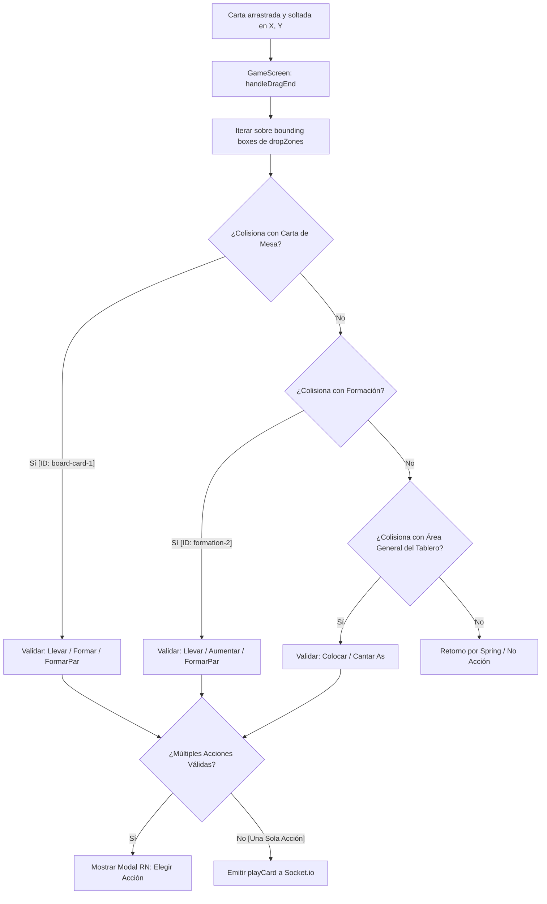

# Especificación Técnica: Componentes de Gameplay en Android (React Native + Expo)

Esta especificación detalla la migración coordinada de los componentes del tablero de juego de **Kasino21** desde la web a la versión móvil nativa de **Android**:

1. [ActionPanel.tsx](file:///c:/Users/angel/Desktop/Develop/Web%20all%20projects/casino-21-card-game/src/web/components/ActionPanel.tsx) -> Panel de Acciones Activas
2. [DroppableFormation.tsx](file:///c:/Users/angel/Desktop/Develop/Web%20all%20projects/casino-21-card-game/src/web/components/DroppableFormation.tsx) -> Formaciones en el Tablero (Zonas Droppable)
3. [HandView.tsx](file:///c:/Users/angel/Desktop/Develop/Web%20all%20projects/casino-21-card-game/src/web/components/HandView.tsx) -> Contenedor de la Mano del Jugador (Desplazable)
4. [GameScreen.tsx](file:///c:/Users/angel/Desktop/Develop/Web%20all%20projects/casino-21-card-game/src/web/components/GameScreen.tsx) -> Pantalla Principal / Coordinador de Gestos y Colisiones

---

## 1. Arquitectura de Interacción Táctil en Android

Dado que en Android la orientación de la partida es **Landscape obligatoria** (`expo-screen-orientation`), el diseño espacial cambia críticamente: la altura es reducida (eje Y comprimido) y el ancho es extendido (eje X amplio). 

### 1.1 Solución al Conflicto de Gestos: Scroll vs. Arrastre
En [HandView.tsx](file:///c:/Users/angel/Desktop/Develop/Web%20all%20projects/casino-21-card-game/src/web/components/HandView.tsx) la mano del jugador se puede desplazar horizontalmente si tiene muchas cartas. En React Native, un `<ScrollView>` horizontal interceptaría el arrastre vertical de `PanGestureHandler`.
* **Solución Técnica**: El componente coordinador `GameScreen` mantiene un estado `scrollEnabled` (Shared Value o state). Cuando cualquier carta activa su estado `onStart` de arrastre, se cambia `scrollEnabled` a `false` bloqueando el scroll del contenedor. Al finalizar (`onEnd`), se vuelve a cambiar a `true`.

---

## 2. Especificación y Código del Coordinador ([GameScreen.tsx](file:///c:/Users/angel/Desktop/Develop/Web%20all%20projects/casino-21-card-game/src/web/components/GameScreen.tsx))

El nuevo componente nativo actúa como el motor de colisiones físicas en 2D, gestionando el layout de los drop targets.



### 2.1 Registro de Bounding Boxes (Layout Registry)
Cada zona receptora de cartas registra su posición absoluta mediante un hook o callback enviado por `GameScreen`:

```typescript
// Tipo para definir las hitboxes en pantalla
export interface BoundingBox {
  id: string;
  type: 'boardCard' | 'formation' | 'board';
  x: number;
  y: number;
  width: number;
  height: number;
}
```

### 2.2 Estructura Core del Coordinador en Android
Aquí se ilustra el reemplazo de `DndContext` de `@dnd-kit/core` por la lógica nativa coordinada:

```tsx
import React, { useState, useRef, useCallback } from 'react';
import { View, StyleSheet, Modal, Text, Pressable } from 'react-native';
import { GestureHandlerRootView } from 'react-native-gesture-handler';
import { useGame } from '../hooks/useGame';
import { HandView } from './HandView';
import { BoardView } from './BoardView';
import { ActionPanel, ActionPayload } from './ActionPanel';
import { Card } from '../../domain/card';
import { DefaultActionValidator } from '../../application/action-validator';

export function GameScreenAndroid() {
  const { gameState, playCard, localPlayerId } = useGame();
  
  // Registro de hitboxes
  const hitboxesRef = useRef<Record<string, BoundingBox>>({});
  const [scrollEnabled, setScrollEnabled] = useState(true);
  const [dragModalData, setDragModalData] = useState<{
    card: Card;
    targetId: string;
    targetType: 'boardCard' | 'formation' | 'board';
    actions: ActionPayload[];
  } | null>(null);

  // Registro dinámico de coordenadas absolutas
  const registerDropZone = useCallback((id: string, type: BoundingBox['type'], layout: { x: number, y: number, width: number, height: number }) => {
    hitboxesRef.current[id] = { id, type, ...layout };
  }, []);

  const unregisterDropZone = useCallback((id: string) => {
    delete hitboxesRef.current[id];
  }, []);

  // Detector de Colisiones (Point-in-Rectangle Hit Test)
  const handleCardDragEnd = (card: Card, absoluteX: number, absoluteY: number) => {
    setScrollEnabled(true); // Reactivar scroll

    let targetZone: BoundingBox | null = null;

    // Buscar colisión
    for (const id in hitboxesRef.current) {
      const box = hitboxesRef.current[id];
      if (
        absoluteX >= box.x &&
        absoluteX <= box.x + box.width &&
        absoluteY >= box.y &&
        absoluteY <= box.y + box.height
      ) {
        // Encontró colisión
        targetZone = box;
        break;
      }
    }

    if (!targetZone) return; // Retorno automático por Spring en DraggableCard

    // Validar acciones disponibles usando las reglas de negocio
    const validator = new DefaultActionValidator();
    const possibleActions: ActionPayload[] = [];
    const playerId = localPlayerId!;

    const testAction = (actionPayload: ActionPayload) => {
      const fullAction = { ...actionPayload, playerId, cardId: card.id };
      const result = validator.validate(gameState, fullAction as any);
      if (result.success) {
        possibleActions.push(actionPayload);
      }
    };

    if (targetZone.type === 'boardCard') {
      testAction({ type: 'llevar', boardCardIds: [targetZone.id], formationIds: [] });
      testAction({ type: 'formar', boardCardIds: [targetZone.id] });
      testAction({ type: 'formarPar', boardCardIds: [targetZone.id] });
    } else if (targetZone.type === 'formation') {
      testAction({ type: 'llevar', boardCardIds: [], formationIds: [targetZone.id] });
      testAction({ type: 'formarPar', formationId: targetZone.id });
      testAction({ type: 'aumentarFormacion', formationId: targetZone.id });
    } else if (targetZone.type === 'board') {
      testAction({ type: 'colocar' });
      testAction({ type: 'cantar' });
    }

    if (possibleActions.length === 1) {
      // Una sola acción válida: ejecutar directamente
      playCard({ ...possibleActions[0], playerId, cardId: card.id } as any);
    } else if (possibleActions.length > 1) {
      // Múltiples acciones: requerir decisión del usuario
      setDragModalData({ card, targetId: targetZone.id, targetType: targetZone.type, actions: possibleActions });
    }
  };

  return (
    <GestureHandlerRootView style={styles.container}>
      {/* Estructura del tablero adaptada a Landscape */}
      <View className="flex-1 flex-row">
        {/* Tablero Principal y Mano */}
        <View className="flex-1 flex-col justify-between p-2">
          {/* Oponente arriba */}
          
          {/* Tablero en el centro (Zonas de Drop) */}
          <BoardView 
            gameState={gameState} 
            registerDropZone={registerDropZone}
            unregisterDropZone={unregisterDropZone}
          />
          
          {/* Mano de cartas abajo */}
          <HandView 
            player={gameState.players.find(p => p.id === localPlayerId)!}
            scrollEnabled={scrollEnabled}
            setScrollEnabled={setScrollEnabled}
            onDragEnd={handleCardDragEnd}
          />
        </View>

        {/* Panel Lateral de Acciones y Chat en Landscape */}
        <View className="w-1/4 bg-black/40 border-l border-white/10 p-2">
          <ActionPanel gameState={gameState} />
        </View>
      </View>

      {/* Modal de Resolución de Gestos (Acciones múltiples en Drop) */}
      {dragModalData && (
        <Modal transparent visible animationType="fade">
          <View className="flex-1 items-center justify-center bg-black/80">
            <View className="bg-slate-900 border border-white/20 p-6 rounded-2xl w-80">
              <Text className="text-white text-lg font-bold mb-4 text-center">Selecciona una Acción</Text>
              {dragModalData.actions.map((act, idx) => (
                <Pressable
                  key={idx}
                  className="bg-cyan-600 p-3 rounded-xl mb-2"
                  onPress={() => {
                    playCard({ ...act, playerId: localPlayerId!, cardId: dragModalData.card.id } as any);
                    setDragModalData(null);
                  }}
                >
                  <Text className="text-white text-center font-bold capitalize">{act.type}</Text>
                </Pressable>
              ))}
              <Pressable className="mt-4 p-2" onPress={() => setDragModalData(null)}>
                <Text className="text-gray-400 text-center">Cancelar</Text>
              </Pressable>
            </View>
          </View>
        </Modal>
      )}
    </GestureHandlerRootView>
  );
}

const styles = StyleSheet.create({
  container: { flex: 1, backgroundColor: '#020617' },
});
```

---

## 3. Especificación del Componente [HandView.tsx](file:///c:/Users/angel/Desktop/Develop/Web%20all%20projects/casino-21-card-game/src/web/components/HandView.tsx)

* **Cambio de UI**: Reemplaza el contenedor de scroll web por un `<ScrollView>` horizontal nativo.
* **Control de Scroll**: Configura la prop `scrollEnabled` dinámicamente según el estado de arrastre del gesto de la carta.

```tsx
import React from 'react';
import { ScrollView, View, Text } from 'react-native';
import { Player } from '../../domain/player';
import { DraggableCard } from './DraggableCard';
import { Card } from '../../domain/card';

interface HandViewProps {
  player: Player;
  scrollEnabled: boolean;
  setScrollEnabled: (enabled: boolean) => void;
  onDragEnd: (card: Card, x: number, y: number) => void;
}

export function HandView({ player, scrollEnabled, setScrollEnabled, onDragEnd }: HandViewProps) {
  const hand = player?.hand || [];

  return (
    <View className="p-3 bg-cyan-950/20 border border-cyan-500/20 rounded-2xl">
      <ScrollView
        horizontal
        scrollEnabled={scrollEnabled}
        showsHorizontalScrollIndicator={false}
        className="flex-row py-2"
      >
        {hand.map((card) => (
          <View key={card.id} className="mr-3">
            <DraggableCard 
              card={card}
              onDragStart={() => setScrollEnabled(false)}
              onDragEnd={onDragEnd}
            />
          </View>
        ))}
      </ScrollView>
    </View>
  );
}
```

---

## 4. Especificación del Componente [DroppableFormation.tsx](file:///c:/Users/angel/Desktop/Develop/Web%20all%20projects/casino-21-card-game/src/web/components/DroppableFormation.tsx)

* **Reemplazo de useDroppable**: No se usa `useDroppable`. En su lugar, el componente mide su propio espacio absoluto en pantalla mediante `onLayout` y reporta las coordenadas a `GameScreen`.
* **Resaltado Visual (`isOver`)**: Se reemplaza por un prop `isHighlighted` que envía el coordinador `GameScreen` cuando calcula que las coordenadas de arrastre colisionan con esta hitbox en tiempo real.

```tsx
import React, { useRef, useEffect } from 'react';
import { View, Text } from 'react-native';
import { CardView } from './CardView';
import { Card } from '../../domain/card';

interface Formation {
  id: string;
  cards: readonly Card[];
  value: number;
  isGroup?: boolean;
}

interface DroppableFormationProps {
  formation: Formation;
  isHighlighted?: boolean;
  selected?: boolean;
  onLayoutMeasured: (id: string, layout: { x: number, y: number, width: number, height: number }) => void;
  onUnmount: (id: string) => void;
}

export function DroppableFormation({
  formation,
  isHighlighted = false,
  selected = false,
  onLayoutMeasured,
  onUnmount,
}: DroppableFormationProps) {
  const viewRef = useRef<View>(null);

  const handleLayout = () => {
    viewRef.current?.measureInWindow((x, y, width, height) => {
      onLayoutMeasured(formation.id, { x, y, width, height });
    });
  };

  useEffect(() => {
    return () => {
      onUnmount(formation.id);
    };
  }, [formation.id]);

  return (
    <View
      ref={viewRef}
      onLayout={handleLayout}
      className={`
        p-4 rounded-xl border-2 transition-all duration-200 relative
        ${selected ? 'border-yellow-400 bg-white/10' : 'border-yellow-500/20 bg-black/30'}
        ${isHighlighted ? 'border-green-400 bg-green-500/20 scale-105' : ''}
      `}
    >
      <Text className="text-yellow-400 text-xs font-bold text-center mb-2">Valor: {formation.value}</Text>
      <View className="flex-row">
        {formation.cards.map((card, i) => (
          <View key={card.id} style={{ marginLeft: i > 0 ? -30 : 0 }}>
            <CardView card={card} />
          </View>
        ))}
      </View>
    </View>
  );
}
```

---

## 5. Adaptación del Componente [ActionPanel.tsx](file:///c:/Users/angel/Desktop/Develop/Web%20all%20projects/casino-21-card-game/src/web/components/ActionPanel.tsx)

En el dispositivo móvil (orientación Landscape), el panel de acciones se renderiza como una barra lateral derecha fija.
* **Componentes de UI Nativa**: Los botones cambian de `<button>` a `<Pressable>` y se les agrega feedback táctil con escala e interactividad nativa de NativeWind.
* **Manejo de Espacio**: Dado el espacio reducido en Landscape, los textos de ayuda (e.g., *"Selecciona una carta..."*) se renderizan en fuente compacta (`text-xs`), y los botones se agrupan en una grilla de 2 columnas.

```tsx
import React from 'react';
import { View, Text, Pressable } from 'react-native';
import { GameState } from '../../domain/game-state';
import { ActionPayload } from './ActionPanel'; // Tipos compartidos

interface ActionPanelProps {
  gameState: GameState;
  selectedHandCardId: string | null;
  selectedBoardCardIds: Set<string>;
  selectedFormationIds: Set<string>;
  onPlayAction: (action: ActionPayload) => void;
  onClearSelection: () => void;
}

export function ActionPanel({
  gameState,
  selectedHandCardId,
  selectedBoardCardIds,
  selectedFormationIds,
  onPlayAction,
  onClearSelection,
}: ActionPanelProps) {
  if (!selectedHandCardId) {
    return (
      <View className="flex-1 items-center justify-center p-3">
        <Text className="text-gray-400 text-xs text-center">
          Toca o arrastra una carta de tu mano para iniciar jugada.
        </Text>
      </View>
    );
  }

  // Lógica idéntica de negocio (llevar, colocar, formar, agrupar, etc.)
  const hasBoardCards = selectedBoardCardIds.size > 0;
  const hasFormations = selectedFormationIds.size > 0;

  return (
    <View className="flex-1 flex-col justify-between py-2">
      <Text className="text-white text-xs font-black mb-2 uppercase tracking-wider text-center">
        Acciones Disponibles
      </Text>

      <View className="flex-row flex-wrap gap-2 justify-center">
        {!hasBoardCards && !hasFormations ? (
          <>
            <Pressable 
              className="w-[45%] bg-blue-600 active:bg-blue-500 py-3 rounded-xl"
              onPress={() => onPlayAction({ type: 'colocar' })}
            >
              <Text className="text-white text-center text-xs font-bold">Colocar</Text>
            </Pressable>
            <Pressable 
              className="w-[45%] bg-purple-600 active:bg-purple-500 py-3 rounded-xl"
              onPress={() => onPlayAction({ type: 'cantar' })}
            >
              <Text className="text-white text-center text-xs font-bold">Cantar As</Text>
            </Pressable>
          </>
        ) : (
          <>
            <Pressable 
              className="w-[92%] bg-green-600 active:bg-green-500 py-3 rounded-xl"
              onPress={() => onPlayAction({
                type: 'llevar',
                boardCardIds: Array.from(selectedBoardCardIds),
                formationIds: Array.from(selectedFormationIds)
              })}
            >
              <Text className="text-white text-center text-xs font-bold">Llevar</Text>
            </Pressable>
            {selectedBoardCardIds.size > 0 && selectedFormationIds.size === 0 && (
              <>
                <Pressable 
                  className="w-[45%] bg-yellow-600 active:bg-yellow-500 py-3 rounded-xl"
                  onPress={() => onPlayAction({ type: 'formar', boardCardIds: Array.from(selectedBoardCardIds) })}
                >
                  <Text className="text-black text-center text-xs font-bold">Formar</Text>
                </Pressable>
                <Pressable 
                  className="w-[45%] bg-orange-600 active:bg-orange-500 py-3 rounded-xl"
                  onPress={() => onPlayAction({ type: 'formarPar', boardCardIds: Array.from(selectedBoardCardIds) })}
                >
                  <Text className="text-white text-center text-xs font-bold">Agrupar</Text>
                </Pressable>
              </>
            )}
          </>
        )}
      </View>

      <Pressable 
        className="w-full bg-white/10 active:bg-white/20 py-2.5 rounded-xl mt-4"
        onPress={onClearSelection}
      >
        <Text className="text-gray-300 text-center text-xs font-bold">Cancelar Selección</Text>
      </Pressable>
    </View>
  );
}
```
