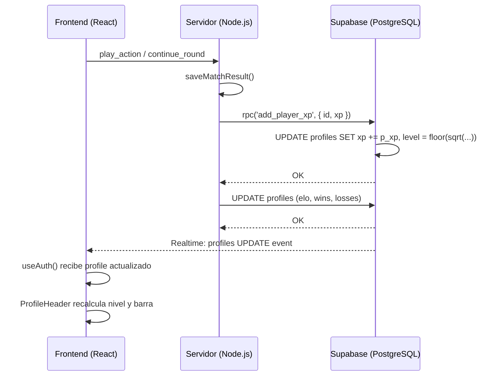

# 🎰 Casino 21 — Sistema de XP y Progresión de Niveles

> **Versión:** 1.0  
> **Última actualización:** 2026-04-23  
> **Autor:** Antigravity AI  

---

## Índice

1. [Visión General](#1-visión-general)
2. [Fórmula de Niveles](#2-fórmula-de-niveles)
3. [Tabla de Progresión](#3-tabla-de-progresión)
4. [Fuentes de XP](#4-fuentes-de-xp)
5. [Arquitectura Técnica](#5-arquitectura-técnica)
6. [Flujo de Datos](#6-flujo-de-datos)
7. [Extensibilidad](#7-extensibilidad)

---

## 1. Visión General

El sistema de XP es el eje de la progresión del jugador en Casino 21. Permite que cada partida —independientemente del resultado— contribuya al crecimiento del perfil del usuario.

**Principios de diseño:**
- ✅ Siempre se gana XP, incluso perdiendo
- ✅ Las partidas PvP dan más XP que las partidas vs Bot
- ✅ El nivel se recalcula automáticamente en la base de datos
- ✅ La barra de progreso en el perfil refleja el avance en tiempo real

---

## 2. Fórmula de Niveles

### Nivel a partir de XP

```
nivel = floor( sqrt( xp / 100 ) )
```

### XP total requerido para alcanzar un nivel

```
xp_requerido(N) = N² × 100
```

La curva crece de forma **cuadrática**, lo que significa que los primeros niveles se alcanzan rápido (para enganchar al jugador), pero los niveles altos requieren dedicación sostenida.

### Implementaciones

**Base de datos (PostgreSQL / Supabase):**
```sql
-- database/supabase-full-migration.sql
CREATE OR REPLACE FUNCTION public.calculate_level_from_xp(xp INTEGER)
RETURNS INTEGER AS $$
  SELECT FLOOR(SQRT(xp / 100.0))::INTEGER;
$$ LANGUAGE sql IMMUTABLE;
```

**Frontend (TypeScript — `ProfileHeader.tsx`):**
```typescript
export function calculateLevelFromXp(xp: number): number {
  return Math.floor(Math.sqrt(xp / 100));
}

export function xpForLevel(level: number): number {
  return level * level * 100;
}
```

> [!IMPORTANT]
> Ambas implementaciones (DB y frontend) deben mantenerse sincronizadas. La fuente de verdad es la función SQL; el frontend la replica para cálculos de UI sin necesidad de hacer queries adicionales.

---

## 3. Tabla de Progresión

| Nivel | XP Mínimo (total) | XP para subir al siguiente | Victorias PvP equivalentes |
|-------|-------------------|---------------------------|---------------------------|
| 0     | 0 XP              | 100 XP                    | 2 victorias               |
| 1     | 100 XP            | 300 XP                    | 6 victorias               |
| 2     | 400 XP            | 500 XP                    | 10 victorias              |
| 3     | 900 XP            | 700 XP                    | 14 victorias              |
| 4     | 1.600 XP          | 900 XP                    | 18 victorias              |
| 5     | 2.500 XP          | 1.100 XP                  | 22 victorias              |
| 10    | 10.000 XP         | 2.100 XP                  | 42 victorias              |
| 20    | 40.000 XP         | 4.100 XP                  | 82 victorias              |

> [!TIP]
> La barra de progreso del perfil muestra el XP relativo al nivel actual:  
> `progreso = (xp_actual - xp_mínimo_nivel) / (xp_siguiente_nivel - xp_mínimo_nivel) × 100`

---

## 4. Fuentes de XP

### 4.1 Partidas PvP (Jugador vs Jugador)

Son la fuente principal de XP y también afectan ELO, wins/losses e historial.

| Resultado   | XP Ganado |
|-------------|-----------|
| 🏆 Victoria | **+50 XP** |
| 💀 Derrota  | **+15 XP** |
| 🤝 Empate   | **+15 XP** cada uno |

### 4.2 Partidas vs Bot

Las partidas vs Bot **no** afectan ELO ni se guardan en el historial, pero sí otorgan XP reducido para permitir práctica con progresión.

| Resultado             | XP Ganado |
|-----------------------|-----------|
| 🏆 Victoria vs Bot    | **+20 XP** |
| 💀 Derrota vs Bot     | **+5 XP** |

### 4.3 Partidas de Torneo

Las partidas de torneo usan el mismo flujo que las partidas PvP (`saveMatchResult`), por lo que aplican los mismos valores de XP (+50 / +15).

> [!NOTE]
> En partidas de torneo, el ganador final también recibe el premio en monedas del `prize_pool` del evento. El XP es adicional a esa recompensa.

### 4.4 Fuentes Futuras (no implementadas aún)

| Fuente                    | XP Sugerido |
|---------------------------|-------------|
| Completar misión diaria   | +25 XP      |
| Logro desbloqueado        | Según `xp_reward` en tabla `achievements` |
| Primer acceso del día     | +10 XP      |
| Invitar a un amigo        | +50 XP      |

---

## 5. Arquitectura Técnica

### 5.1 Base de Datos

**Tabla `profiles`** — campos relacionados con XP:

```sql
xp    INTEGER NOT NULL DEFAULT 0,
level INTEGER NOT NULL DEFAULT 0,
```

**RPC `add_player_xp`** — único punto de escritura de XP:

```sql
-- Llamado por: supabase.rpc('add_player_xp', { p_player_id, p_xp })
CREATE OR REPLACE FUNCTION public.add_player_xp(p_player_id UUID, p_xp INTEGER)
RETURNS VOID AS $$
  UPDATE profiles SET
    xp    = xp + p_xp,
    level = FLOOR(SQRT((xp + p_xp) / 100.0))::INTEGER
  WHERE id = p_player_id;
$$ LANGUAGE sql;
```

> [!IMPORTANT]
> **Siempre usar el RPC**, nunca hacer un `UPDATE profiles SET xp = ...` directo. El RPC garantiza que `level` se recalcula atómicamente junto con el XP.

### 5.2 Backend (Node.js / Socket.io)

**Archivo:** `server/src/index.ts` — función `saveMatchResult`

```typescript
// Partida PvP — al finalizar
const XP_WIN  = 50;
const XP_LOSS = 15;

await Promise.all([
  supabase.rpc('add_player_xp', { p_player_id: winnerId, p_xp: XP_WIN }),
  supabase.rpc('add_player_xp', { p_player_id: loserId,  p_xp: XP_LOSS }),
]);
```

```typescript
// Partida vs Bot — solo el humano recibe XP
const xpGain = humanWon ? 20 : 5;
await supabase.rpc('add_player_xp', { p_player_id: humanPlayer.userId, p_xp: xpGain });
```

### 5.3 Frontend (React / TypeScript)

**Archivo:** `src/web/components/ProfileHeader.tsx`

```typescript
const xp    = profile?.xp || 0;
const level = calculateLevelFromXp(xp);          // floor(sqrt(xp/100))
const nextLevelXp     = xpForLevel(level + 1);   // (level+1)² × 100
const currentLevelXp  = xpForLevel(level);        // level² × 100
const progress = ((xp - currentLevelXp) / (nextLevelXp - currentLevelXp)) * 100;
```

La UI muestra:
- `NIVEL {level}` — nivel actual
- `{xp - currentLevelXp} / {nextLevelXp - currentLevelXp} XP` — progreso al siguiente nivel
- Barra de progreso animada

---

## 6. Flujo de Datos



> [!NOTE]
> El frontend recibe la actualización vía **Supabase Realtime** (canal `postgres_changes` en la tabla `profiles`). No es necesario ningún emit extra desde el servidor.

---

## 7. Extensibilidad

### Añadir una nueva fuente de XP

1. **En el servidor** — llamar al RPC donde corresponda:
   ```typescript
   await supabase.rpc('add_player_xp', {
     p_player_id: userId,
     p_xp: 25  // XP a otorgar
   });
   ```

2. **Constantes recomendadas** — centralizar los valores en `server/src/index.ts`:
   ```typescript
   const XP_REWARDS = {
     PVP_WIN:         50,
     PVP_LOSS:        15,
     BOT_WIN:         20,
     BOT_LOSS:         5,
     DAILY_QUEST:     25,  // (futuro)
     ACHIEVEMENT:     0,   // variable según logro
   } as const;
   ```

3. **Notificar al jugador** — tras otorgar XP, opcionalmente insertar en `notifications`:
   ```typescript
   await supabase.from('notifications').insert({
     player_id: userId,
     type: 'xp_gained',
     content: `¡Ganaste ${xpGain} XP! 🎉`,
     is_read: false,
   });
   ```

### Modificar los valores de XP

Los valores están definidos como constantes en `server/src/index.ts`:

```typescript
const XP_WIN  = 50;   // línea ~871
const XP_LOSS = 15;   // línea ~872
// Bot:
const xpGain = humanWon ? 20 : 5;  // línea ~791
```

No se necesita migración de DB para cambiar estos valores.

---

## Archivos Relacionados

| Archivo | Propósito |
|---------|-----------|
| `server/src/index.ts` | Lógica de otorgamiento de XP al final de partida |
| `src/web/components/ProfileHeader.tsx` | Visualización de nivel y barra de progreso |
| `database/supabase-full-migration.sql` | Definición del RPC `add_player_xp` y `calculate_level_from_xp` |
